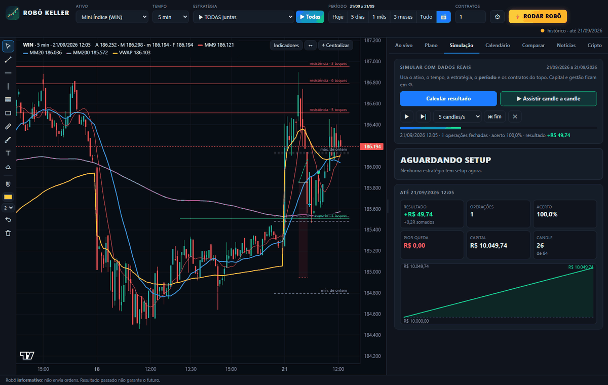

# ROBÔ KELLER

Robô **informativo** de day trade: mostra quando uma estratégia arma uma entrada (entrada, stop e alvo), simula com
dados reais quanto ela teria ganhado ou perdido, diz qual estratégia está se encaixando melhor no mercado de agora
e traz as notícias que mexem no mercado brasileiro. **Não envia ordens para a corretora.**

Núcleo: setups do **Mario Pisani** com os ideais do **Oliver Velez**, o modelo **OGRO** (pivô + Fibonacci, no estilo
de André Machado), e três estratégias pesquisadas em estudos e fóruns (RSI-2 de Connors, ORB de Zarattini & Aziz e
fechamento de gap). A Teoria de Dow aparece só como leitura de contexto.



---

## Como abrir

- **`RoboKeller.exe`** (na página de *Releases* do GitHub): dois cliques. Abre uma janela com o robô; a janela preta
  precisa ficar aberta.
- Ou, com Python 3.10+ instalado: **`Abrir_Robo_com_Python.bat`** (não precisa instalar nenhuma biblioteca).

Os dados baixados, os desenhos e o histórico ficam na pasta `dados` (ao lado do .exe).

## A tela

**Topo:** ativo · tempo gráfico (2, 5, 15, 30, 60 min ou Diário) · gestão da operação · contratos (lotes no forex/CFD).

**Barra de estratégias:** escolha uma das 9, ou:
- **▶ RODAR TODAS JUNTAS**: as 9 procuram entrada ao mesmo tempo, com **uma operação por vez** (a primeira ordem que
  executar vale; as outras são canceladas).
- **⚡ RODAR ROBÔ**: testa todas as estratégias em 5, 15 e 60 min no ativo escolhido e mostra a **estratégia do
  momento** (a que mais rendeu por dia nos últimos 20 pregões, puxada para o histórico todo para não escolher por
  sorte de uma semana) e a **projeção de ganho/perda** para o próximo mês e até 31/12 (Monte Carlo com as operações
  reais dela: resultado mais provável, faixa de 80% dos cenários, chance de terminar no prejuízo e a queda que pode
  aparecer no caminho). Se nenhuma estratégia tiver histórico positivo com pelo menos 20 operações, ele diz
  **FICAR DE FORA**.

A bolinha no botão mostra quem está com ordem armada (azul = compra, rosa = venda), em operação (verde) ou em atenção (laranja).

| Aba | O que faz |
|---|---|
| **Ao vivo** | Cartão "o que fazer agora" (aguardando, atenção, ordem armada com entrada/stop/alvo e risco em dinheiro, ou em operação), histórico da estratégia no ativo com veredito, contexto de Dow e últimas operações. Atualiza a cada 60 s com alarme sonoro. |
| **Simulação** | Escolha o período e o capital: resultado, acerto, média por operação, fator de lucro, pior queda, curva do capital, resultado por mês e cada operação (CSV). **Assistir candle a candle** faz o gráfico andar como se fosse ao vivo. |
| **Calendário** | Um calendário por mês com o resultado de cada dia; clique no dia para ver cada operação (estratégia, horário, entrada, saída, motivo, R e dinheiro). Com TODAS juntas dá para ver cada estratégia sozinha e o resumo do mês por estratégia. |
| **Comparar** | As 9 estratégias + TODAS em todos os ativos, colorido pelo veredito. Clique numa célula para simular. |
| **Notícias** | Banco Central, Valor, InfoMoney, Money Times, g1, E-Investidor, Investing e Google Notícias, a cada 60 s. Classifica o impacto (Copom, Selic, IPCA, Fed, fiscal, tarifas, Petrobras…) e se mexe no WIN, no WDO ou nos dois. Notícia nova de alto impacto acende o contador e toca um aviso. |

**Ferramentas de desenho** (à esquerda do gráfico): tendência, horizontal, vertical, Fibonacci, retângulo, régua,
pincel, texto, borracha, ímã. Ficam salvos por ativo.

## Ativos e dados

| Ativo | Fonte intraday | Histórico em 2–30 min |
|---|---|---|
| EUR/USD, GBP/USD, USD/JPY, AUD/USD, **XAU/USD** | Dukascopy (feed ECN, candles de 1 min) + hoje pelo Yahoo, com nível ajustado | 5 meses |
| **USTEC** (Nasdaq 100, horário de Nova York) | Dukascopy + hoje pelo Yahoo | 5 meses |
| **JP225** (Nikkei 225, horário de Tóquio) | Dukascopy + hoje pelo Yahoo | 5 meses |
| **BTC/USD** (24 h) | Binance (1 min, tempo real) | 5 meses |
| WIN, WDO (substitutos: Ibovespa à vista e USD/BRL), prata, petróleo | Yahoo | 60 dias, e cresce: cada download fica guardado |
| Qualquer ativo | CSV exportado do Profit/MetaTrader na pasta `dados` | o que você exportar |

O diário vem do Yahoo (10 anos). A **base de 5 meses** é baixada uma vez e depois só completa os dias novos. A
Dukascopy limita pedidos, então a primeira vez leva algumas horas e roda em segundo plano (o rodapé mostra o
andamento); enquanto isso o robô usa o Yahoo. Para o WIN e o WDO **reais**, exporte o gráfico do Profit em CSV.

## As 9 estratégias

| | Estratégia | Autor / fonte | Regras (compra; a venda é o espelho exato) | Onde se encaixa |
|---|---|---|---|---|
| E1 | Halt na MM20 | Pisani + Velez | MM20 inclinada, acima da MM200; correção de 1 a 8 candles (3-5-8) que encosta na MM20 sem fechar abaixo; sem barra elefante contra; candle de confirmação (1 candle só com Gift) | 5 e 15 min, ativos em tendência |
| E2 | Gatilho de Fibonacci | Pisani | Impulso ≥ 2 ATR; correção entre 38,2% e 61,8%; candle de confirmação acima de 61,8% | 5 e 15 min; diário em ouro e prata |
| E3 | Pullback na VWAP | Pisani + Velez | Dia de tendência (70% dos fechamentos acima da VWAP), afastou 1 ATR e voltou a testar a VWAP sem fechar abaixo | 15 min, índices e forex |
| E4 | Rompimento de base | Velez (power breakout) | Base de 4 candles com até 1,2 ATR no topo do movimento, apoiada na MM20 | 5 min e diário |
| E5 | Combinação perfeita + Gift na MM9 | Velez + Pisani | MM9 > MM20 > MM200 inclinadas; correção de 1 a 3 candles na MM9; candle Gift | 5 e 60 min, tendência forte |
| E6 | RSI(2) de Connors | Larry Connors (fóruns) | Acima da MM200 e RSI(2) < 10: compra na abertura; sai quando fecha acima da MM5 ou em 10 candles; stop de proteção a 3 ATR | Diário, índices |
| E7 | Rompimento do 1º candle (ORB) | Zarattini & Aziz (2023) | 1º candle do pregão de alta: compra na abertura do 2º; stop na mínima do 1º; alvo 10R ou zeragem. **Acerta pouco (~20%) e ganha grande** | 5 min, índices na abertura |
| E8 | Fechamento de gap | Estatística de gaps (Nasdaq 2015–2025) | Gap de 0,05% a 0,40% dentro da faixa de ontem, ainda aberto após 15 min: entra para fechar o gap; alvo no fechamento de ontem; stop largo. **Acerta muito e ganha pouco**; só em dado com gap real (USTEC/JP225 da Dukascopy, CSV do Profit) | 5 min, índices futuros |
| E9 | **OGRO: pivô + Fibonacci** | Estilo André Machado (Ogro de Wall Street) | MM9 > MM20 > MM200 (simples, alinhadas); pernada ≥ 2 ATR; correção até **no máximo 50%**; compra no **rompimento do pivô** (topo da pernada), stop abaixo do fundo; alvos na **projeção de Fibonacci**: 100% (metade + stop no 0x0) e 161,8% | 5 e 15 min, índices, ouro e BTC em tendência |

"Onde se encaixa" é o ponto de partida; o **⚡ RODAR ROBÔ** mede isso de novo com os dados de hoje.

Filtros comuns: risco entre 0,3 e 2,5 ATR; no intraday, sem entradas fora do horário, zeragem no horário do ativo e o
dia para depois de N stops (padrão 2). A ordem vale de 1 a 2 candles e é cancelada se o preço for ao stop antes de ativar.

**Gestões** (menu no topo): Padrão de cada estratégia · Alvo 2:1 · Alvo 3:1 · Parcial (metade no 1:1, stop no 0x0,
resto no 2:1) · Condução (metade no 1:1, stop no 0x0, resto carregado pela MM9). Parcial precisa de 2 contratos na B3.

## Como o simulador executa (conservador de propósito)

- Ordem stop executa no gatilho (ou na abertura, se abrir além) **mais o escorregamento**; stop sai **menos** o escorregamento.
- Alvo só conta se o preço passar **1 tick além** dele; candle que toca stop e alvo conta como **stop**.
- Saídas por fechamento (MM9, RSI-2) executam na abertura do candle seguinte.
- Custos por lado: WIN 5 pts + R$ 0,30 · WDO 0,5 pt + R$ 1,20 · forex 0,6–0,8 pip + US$ 3,50 · ouro 0,20 ·
  USTEC 1 pt · JP225 5 pts · BTC US$ 10.

Conferências: 7.426 operações refeitas por um cálculo independente (0 diferenças); rodar só até um candle do passado dá
as mesmas operações que rodar com tudo (o robô não usa o futuro).

## Como ler o veredito

| Veredito | Quando |
|---|---|
| **VANTAGEM ESTATÍSTICA** | média por operação positiva, margem de erro (95%) acima de zero e positiva nas duas metades |
| INSTÁVEL | positiva no total, mas uma das metades foi negativa |
| PROMISSORA, NÃO COMPROVADA | positiva, mas a margem de erro ainda inclui zero (pode ser sorte) |
| POUCOS DADOS | menos de 30 operações |
| NÃO OPERAR | média negativa depois dos custos |

## O que os dados mostraram (30/09/2026)

- **Nenhuma estratégia é infalível** e nenhuma combinação chegou a "vantagem estatística" ainda. Com custos reais, a
  maioria perde dinheiro em forex de 5 min.
- **BTC/USD (5 meses):** E7 ORB em 60 min +US$ 10.568 em 144 operações (acerto 19%); E9 OGRO em 5 min +US$ 3.772 em
  185 operações (acerto 40%). Promissoras, não comprovadas.
- **WIN (60 dias):** E2 Fibonacci +R$ 1.081 (65 operações), E7 ORB +R$ 769 (33), E4 +R$ 545 (24). OGRO com poucas operações.
- **RSI(2):** acerta 55–66%, mas a média fica perto de zero depois dos custos. Acertar muito não é ganhar muito.
- **Gap:** poucos casos por mês (7 a 8 em 60 dias no Nasdaq futuro); ainda sem amostra para concluir.

Esses números mudam a cada pregão: use **⚡ RODAR ROBÔ** e a aba **Comparar** antes de decidir.

## Scripts do Profit (NTSL)

Pasta `ntsl`: um indicador por estratégia (`E1_Halt_MM20.ntsl` … `E9_OGRO.ntsl`). No Profit:
*Ferramentas → Editor de Estratégias → Novo → Indicador*, cole, compile e aplique no gráfico de preço.
Linha **branca** = entrada, **vermelha** = stop, **verde** = alvo.

| Parâmetro | WIN | WDO |
|---|---|---|
| Tick / Slip | 5 / 5 | 0,5 / 0,5 |
| CustoPts (ida e volta, em pontos) | 3 | 0,24 |
| HoraInicio / HoraFimEntradas / HoraZeragem (contrato real) | 905 / 1700 / 1745 (E7 e E8: HoraInicio 0) | 905 / 1700 / 1745 |
| FracParcial (E9) | 0 com 1 contrato, 0,5 com 2 ou mais | idem |
| Intraday | 1 (0 no diário) | 1 |

`ferramentas/conferir_ntsl.py` roda os 9 scripts num interpretador de NTSL sobre os mesmos candles e compara com o
programa: ordens e operações **idênticas** (WIN 5 min, BTC 15 min; o gap no Nasdaq futuro). Ainda não foram
compilados dentro do Profit; se o Profit acusar algum erro, mande o print.

## Para quem mexe no código

```
app/estrategias.py   indicadores e as 9 regras (compra escrita uma vez; venda = gráfico invertido)
app/simulador.py     execução candle a candle e estatística
app/radar.py         "RODAR ROBÔ": estratégia do momento e projeção (Monte Carlo)
app/noticias.py      notícias (RSS/Atom) com classificação de impacto
app/historico.py     base de 5 meses (Dukascopy e Binance)
app/dados_fonte.py   fontes, fusos, custos por ativo, CSV do Profit
app/robo_keller.py   servidor local: /api/config, /api/sim, /api/radar, /api/noticias, /api/base, /api/comparar
app/web/             tela (app.js, sim.js, radar.js, calendario.js, comparar.js, noticias.js, desenho.js)
ferramentas/backtest.py       relatório no terminal:  python ferramentas/backtest.py WIN --tf 15
ferramentas/gerar_ntsl.py     gera a pasta ntsl a partir das mesmas regras
ferramentas/conferir_ntsl.py  confere o NTSL contra o simulador
```

## Fontes

- Mario Pisani, apostila 2022; Oliver Velez, apostila de análise técnica.
- André Machado (Ogro de Wall Street): pivôs, Fibonacci e médias — [Projeto Os 10%](https://projetoos10porcento.com.br/aprenda-com-o-ogro-de-wall-street-a-dominar-ranges-e-breakouts-para-entradas-mais-seguras/),
  [Eu Quero Investir](https://euqueroinvestir.com/educacao-financeira/day-touro-andre-machado-ogro-de-wall-street).
  A E9 é uma leitura objetiva da regra descrita (retração até 50%, rompimento do pivô, alvos de Fibonacci), não o método oficial dele.
- Larry Connors e Cesar Alvarez, *Short Term Trading Strategies That Work* (2008) — [QuantifiedStrategies](https://www.quantifiedstrategies.com/rsi-2-strategy/).
- Zarattini & Aziz (2023), *Can Day Trading Really Be Profitable?* — [Concretum](https://concretumgroup.com/can-day-trading-really-be-profitable/).
- Estatística de gaps — [TradingStats (NQ 2015–2025)](https://tradingstats.net/gap-fill-strategy/), [Trade That Swing](https://tradethatswing.com/sp-500-spy-es-gap-fill-strategy-and-statistics/).

## Aviso

Ferramenta de estudo. Resultado passado não garante resultado futuro, e o robô não dá recomendação de investimento.
Antes de usar dinheiro real: 100 operações no simulador da corretora seguindo o robô, e depois o menor lote possível.

## Licenças de terceiros

Gráficos: [TradingView Lightweight Charts](https://github.com/tradingview/lightweight-charts) (Apache 2.0), incluído em `app/web/lightweight-charts.js`.
