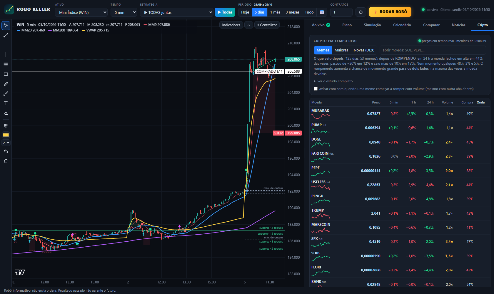

# ROBÔ KELLER

Robô **informativo** de day trade: mostra quando uma estratégia arma uma entrada (entrada, stop e alvo), simula com
dados reais quanto ela teria ganhado ou perdido **depois dos custos**, ajuda a montar um **plano de risco** (tamanho de
cada operação, limite de perda do dia, meta × realidade), acompanha **criptomoedas em tempo real** (inclusive as "meme")
e traz as notícias e a agenda econômica que mexem no mercado. **Não envia ordens para a corretora.**

Núcleo: setups do **Mario Pisani** com os ideais do **Oliver Velez**, o modelo **OGRO** (pivô + Fibonacci, no estilo
de André Machado), o **Keltner em dia lateral do Adriano Mendes (XTraders)** e quatro estratégias tiradas de estudos e
fóruns (RSI-2 de Connors, ORB de Zarattini & Aziz, fechamento de gap e o momentum intraday da "faixa de ruído").
A Teoria de Dow aparece só como leitura.


---

## Novidades da versão 1.3

- **Aba Plano:** tamanho de cada operação pelo risco (% do capital), limite de perda e de ganho do dia, modo seletivo,
  o efeito de cada regra medido no seu período e a conta "meta × realidade".
- **Aba Cripto:** preços da Binance em tempo real, todas as moedas "meme" listadas lá, as maiores, os tokens novos em
  alta nas corretoras descentralizadas (com checagem de golpe) e o que **de fato** aconteceu depois de cada "onda".
- **Agenda econômica** na aba Notícias (Copom, IPCA, payroll, Fed…) e aviso no cartão quando um evento forte está perto.
- **E11 · Momentum do dia (faixa de ruído):** estratégia de estudo acadêmico de 2024. Só no aplicativo.
- **Custos à vista:** quanto do resultado foi embora em taxas e escorregamento, em dinheiro e em % do risco.
- **Contexto de cada sinal:** a favor ou contra a tendência do diário; movimento limpo ou em serrote.
- **Níveis automáticos no gráfico:** máxima, mínima e fechamento de ontem, abertura de hoje, suportes e resistências.
- **Quanto do capital está em jogo:** toda ordem armada e toda operação aberta mostram a perda no stop em % do capital.
- Todos os horários da tela em **horário de Brasília**, mesmo que o computador esteja em outro fuso.
- Corrigido: o gráfico podia quebrar ao trocar de ativo logo depois de trocar de estratégia; os textos das operações
  de **venda** (IFR, "acima/abaixo", "de alta/de baixa") saíam com o lado invertido.

## Como abrir

- **`RoboKeller.exe`** (na página de *Releases* do GitHub): dois cliques. Abre uma janela com o robô; a janela preta
  precisa ficar aberta.
- Ou, com Python 3.10+ instalado: **`Abrir_Robo_com_Python.bat`** (não precisa instalar nenhuma biblioteca).

Os dados baixados, os desenhos e o histórico ficam na pasta `dados` (ao lado do .exe).

## A tela

Ao abrir aparece uma **tela de carregamento** (dados, estratégias, resumo e notícias) e depois a tela principal:

**Topo (uma linha só):** ativo · tempo gráfico · **estratégia** (menu com as 11, ou **▶ Todas**) · **período** ·
contratos · **⚙** (gestão da operação, capital, stops por dia, som) · **⚡ RODAR ROBÔ** · luz verde = ao vivo.

**Período (Hoje · 5 dias · 1 mês · 3 meses · Tudo · 📅 datas):** vale para tudo. O gráfico mostra aquele período e
todos os números (resultado, acerto, pior queda, calendário, simulação, comparação, plano) passam a ser daquele período.
Escolhendo datas no passado, o cartão mostra a situação no fim do período (luz laranja = histórico).

**▶ Todas:** as 11 estratégias procuram entrada ao mesmo tempo, com **uma operação por vez** (a primeira ordem que
executar vale; as outras são canceladas). Clique de novo para voltar à estratégia anterior.

**⚡ RODAR ROBÔ:** testa todas as estratégias em 5, 15 e 60 min no ativo e abre uma janela com a **estratégia do
momento** (a que mais rendeu por dia nos últimos 20 pregões, puxada para o histórico todo para não escolher por sorte
de uma semana) e a **projeção** para o próximo mês e até 31/12 (Monte Carlo com as operações reais dela: resultado mais
provável, faixa de 8 em 10 cenários, chance de terminar no prejuízo e a queda que pode aparecer no caminho). Se nenhuma
tiver histórico positivo com pelo menos 20 operações, ele diz **FICAR DE FORA**.

| Aba | O que faz |
|---|---|
| **Ao vivo** | Cartão "o que fazer agora" (aguardando, atenção, ordem armada com entrada/stop/alvo, tamanho e risco em dinheiro e em % do capital, em operação, ou **PARE POR HOJE** quando um limite do plano bateu), o **teste ao vivo**, o resultado da estratégia no período (curva, custos e veredito) e a lista de **operações**: clique numa para ver no gráfico e ler o passo a passo (sinal → entrada → stop → alvo → saída). Atualiza a cada 30 s (cripto: 10 s, com o preço andando em tempo real). |
| **Plano** | As regras de risco do robô inteiro, o estado do dia, a calculadora de tamanho, o efeito de cada regra e a conta meta × realidade. Veja abaixo. |
| **Simulação** | Resultado do período com curva do capital, resultado por mês e cada operação (CSV com quantidade, custos e contexto). **Assistir candle a candle** faz o gráfico andar como se fosse ao vivo. |
| **Calendário** | Resultado de cada dia; clique no dia para ver cada operação (estratégia, horário, entrada, saída, motivo, R e dinheiro). Com Todas dá para ver cada estratégia sozinha. |
| **Comparar** | As 11 estratégias + Todas em todos os ativos, no período escolhido, colorido pelo veredito. |
| **Notícias** | **Agenda econômica** da semana e as notícias: Banco Central, Valor, InfoMoney, Money Times, g1, E-Investidor, Investing e Google Notícias, a cada 60 s, com o impacto estimado e se mexe no WIN, no WDO ou nos dois. Notícia forte nova acende o contador e apita. |
| **Cripto** | Memes, maiores moedas e tokens novos em tempo real. Veja abaixo. |

### Aba Plano


O que vale aqui vale para o robô inteiro: ao vivo, simulação, calendário, comparação, teste ao vivo e ⚡.

- **Tamanho de cada operação:** *Fixo* (a quantidade do topo) ou **Pelo risco**: você diz quanto do capital aceita
  perder por operação (por exemplo 1%) e o robô calcula a quantidade pela distância do stop, já com os custos. Se nem o
  lote mínimo cabe, a ordem fica de fora ("fora do plano") e isso aparece na tela.
- **Parar o dia:** depois de N stops, ao perder um valor ou ao ganhar um valor. Quando bate, o cartão vira
  **PARE POR HOJE** e o robô não arma mais nada naquele dia.
- **Modo seletivo:** as estratégias de correção (E1 a E5 e E9) só entram a favor da tendência do diário (fechamento de
  ontem acima ou abaixo da média dos 20 fechamentos anteriores) e com movimento limpo (eficiência de Kaufman ≥ 0,35);
  a E7 e a E11 só entram a favor do diário. A E6, a E8 e a E10, que operam a volta do preço, não mudam.
- **Hoje:** resultado do dia, stops usados e quanto falta para cada limite.
- **Tamanho pelo risco (calculadora):** digite entrada e stop (ou deixe o robô preencher com a ordem armada) e veja
  quantos contratos cabem e quanto isso arrisca.
- **O que cada regra fez no período:** a mesma simulação **com** e **sem** cada regra (operações, resultado e pior
  queda), para decidir com número e não com palpite.
- **Meta × realidade:** quanto você quer ganhar por mês e quanto aceita perder. O robô sorteia 4.000 meses com os
  **dias reais** da estratégia e mostra o mês típico, a faixa de 8 em cada 10 cenários, a chance de bater a meta, a
  chance de bater a perda máxima e o tamanho que a meta exigiria. Só calcula com pelo menos 20 pregões e 20 operações.
  A linha "vantagem por operação" traz a margem de erro: enquanto ela incluir o zero, a vantagem **não está comprovada**.

### Aba Cripto



- **Memes** (todas as que a Binance marca como meme, à vista e no futuro perpétuo) e **Maiores** (as 15 de maior
  volume). Preço pelo WebSocket da Binance (tempo real); variação em 5 min, 1 h e 24 h; **volume** da última hora contra
  o normal das 72 h anteriores; quanto do volume foi **compra** a mercado; e a etiqueta de **onda**:
  *rompendo* (passou a máxima de 24 h com volume ≥ 3× o normal), *esquentando* (volume ≥ 2× e +2% na hora),
  *esticada* (+30% em 24 h) e *despencando* (−20% em 24 h).
- **O que veio depois:** o robô refaz o estudo sozinho (a cada 12 h) com o histórico de todas as memes e mostra, para
  cada etiqueta, quantas vezes a moeda fechou em alta nas 4 h e nas 24 h seguintes, e a chance de +20%, +50%, −10% e
  −20%. É a taxa-base para comparar com a empolgação do momento.
- **Clique numa moeda** para abrir no gráfico: as 11 estratégias, a simulação, o plano e o teste ao vivo funcionam
  nela, com a taxa da corretora nas contas. A caixa de busca abre qualquer par em USDT da Binance.
- **Aviso sonoro opcional** quando uma meme começa a romper com volume (funciona com outra aba aberta).
- **Novas (DEX):** os tokens em alta agora nas corretoras descentralizadas (GeckoTerminal), com liquidez, idade e os
  sinais de risco à vista, e o botão **Checar golpe** (RugCheck na Solana; honeypot.is e GoPlus nas redes EVM):
  contrato que não deixa vender, imposto na venda, emissão ainda aberta, liquidez destravada, concentração nos 10
  maiores. O robô não traça gráfico nem estratégia para esses tokens.

**Teste ao vivo (simulado, sem dinheiro):** o botão **▶ Ligar** na aba Ao vivo deixa a estratégia escolhida rodando
a partir do próximo candle, com as regras do plano daquele momento. Cada operação fica registrada (lista + gráfico) e o
robô avisa com som: "tic-tic" quando arma a ordem, "ta-dam" quando executa, e um som para saída no ganho e outro para
saída na perda. Dá para ligar testes em vários ativos ao mesmo tempo e trocar de ativo: eles continuam rodando (o
número verde na aba mostra quantos). **■ Parar** encerra e guarda o resultado. O teste fica salvo em
`dados/estado_testes.json`; se o robô ficou fechado, ao abrir ele reconstitui pelos candles o que teria acontecido.

**Candle aberto:** ao vivo, o último candle ainda está se formando. Nele o robô executa ordem, stop e alvo (o preço já
negociou), mas **sinal novo só sai depois que o candle fecha**, para o sinal não aparecer e sumir.

**Agenda econômica:** eventos com hora marcada do Brasil, dos EUA e das moedas do ativo escolhido (calendário da
ForexFactory, divulgações do IBGE e reuniões do Copom). De 30 min antes até 10 min depois de um evento de impacto alto,
o cartão "o que fazer agora" avisa: nessa hora o mercado costuma saltar e o spread abre.

**Operações no gráfico:** cada operação aparece com a faixa de risco (vermelha, até o stop), a faixa do alvo (verde) e
a linha da entrada até a saída. A operação clicada ganha os preços escritos e o candle de sinal marcado. Em
**Indicadores** dá para deixar só a linha ou só as setas.

**Indicadores** (botão no canto do gráfico): médias móveis à vontade (simples ou exponencial, período e cor), VWAP,
Bandas de Bollinger, Canal de Keltner (o da E10), volume, IFR/RSI e estocástico lento, estes dois em faixas próprias
embaixo do gráfico; **níveis do dia** (máxima, mínima e fechamento de ontem, abertura de hoje) e até 4 **suportes e
resistências** (regiões onde o preço virou várias vezes). A estratégia escolhida mostra o indicador dela (o canal na
E10, a faixa de ruído na E11). São só para leitura: as estratégias não mudam.

**⌖ Centralizar** (ou tecla **Home**) volta para o último candle com a escala automática; **↔** mostra o período
inteiro. Ao trocar de ativo, tempo, estratégia ou período o gráfico já volta sozinho para o preço.

**Largura do painel:** arraste a divisória entre o gráfico e o painel; duplo clique nela volta ao padrão.

**Sons próprios (opcional):** os sons são sintetizados pelo robô. Para usar os seus (por exemplo os do Profit), coloque
arquivos `.wav`, `.mp3` ou `.ogg` na pasta `dados/sons` com os nomes `ordem`, `entrada`, `ganho`, `perda` e `aviso`.

**Desenhos** (barra à esquerda): tendência, horizontal, vertical, Fibonacci, retângulo, régua, pincel, texto, borracha,
ímã. Clique numa linha para selecionar (ela brilha) e aperte **Delete** para apagar; sem nada selecionado, o Delete
apaga o último desenho. Ctrl+Z desfaz. Ficam salvos por ativo.

## Ativos e dados

| Ativo | Fonte intraday | Histórico em 2–30 min |
|---|---|---|
| EUR/USD, GBP/USD, USD/JPY, AUD/USD, **XAU/USD** | Dukascopy (feed ECN, candles de 1 min) + hoje pelo Yahoo, com nível ajustado | 5 meses |
| **USTEC** (Nasdaq 100, horário de Nova York) | Dukascopy + hoje pelo Yahoo | 5 meses |
| **JP225** (Nikkei 225, horário de Tóquio) | Dukascopy + hoje pelo Yahoo | 5 meses |
| **BTC/USD** (24 h) | Binance (1 min, tempo real) | 5 meses |
| **Cripto da aba Cripto** (memes, maiores, qualquer par em USDT) | Binance à vista e futuro perpétuo: candles pela API pública e preço pelo WebSocket (tempo real) | 5 min: 60 dias · 15 min: 4 meses · 60 min: mais de 1 ano |
| WIN, WDO (substitutos: Ibovespa à vista e USD/BRL), prata, petróleo | Yahoo, **com cerca de 15 min de atraso** | 60 dias, e cresce: cada download fica guardado |
| Qualquer ativo | CSV exportado do Profit/MetaTrader na pasta `dados` | o que você exportar |

O diário vem do Yahoo (10 anos). A **base de 5 meses** é baixada uma vez e depois só completa os dias novos. A
Dukascopy limita pedidos, então a primeira vez leva algumas horas e roda em segundo plano (o rodapé mostra o
andamento); enquanto isso o robô usa o Yahoo. Para o WIN e o WDO **reais e em tempo real**, use os scripts no Profit
(abaixo) ou exporte o gráfico do Profit em CSV: nenhuma fonte gratuita entrega o mini-índice e o mini-dólar ao vivo.

## As 11 estratégias

| | Estratégia | Autor / fonte | Regras (compra; a venda é o espelho exato) | Onde se encaixa |
|---|---|---|---|---|
| E1 | Halt na MM20 | Pisani + Velez | MM20 inclinada, acima da MM200; correção de 1 a 8 candles (3-5-8) que encosta na MM20 sem fechar abaixo; sem barra elefante contra; candle de confirmação (1 candle só com Gift) | 5 e 15 min, ativos em tendência |
| E2 | Gatilho de Fibonacci | Pisani | Impulso ≥ 2 ATR; correção entre 38,2% e 61,8%; candle de confirmação acima de 61,8% | 5 e 15 min; diário em ouro e prata |
| E3 | Pullback na VWAP | Pisani + Velez | Dia de tendência (70% dos fechamentos acima da VWAP), afastou 1 ATR e voltou a testar a VWAP sem fechar abaixo | 15 min, índices e forex |
| E4 | Rompimento de base | Velez (power breakout) | Base de 4 candles com até 1,2 ATR no topo do movimento, apoiada na MM20 | 5 min e diário |
| E5 | Combinação perfeita + Gift na MM9 | Velez + Pisani | MM9 > MM20 > MM200 inclinadas; correção de 1 a 3 candles na MM9; candle Gift | 5 e 60 min, tendência forte |
| E6 | RSI(2) de Connors | Larry Connors (fóruns) | Acima da MM200 e RSI(2) < 10: compra na abertura; sai quando fecha acima da MM5 ou em 10 candles; stop de proteção a 3 ATR | Diário, índices |
| E7 | Rompimento do 1º candle (ORB) | Zarattini & Aziz (2023) | 1º candle do pregão de alta: compra na abertura do 2º; stop na mínima do 1º; alvo 10R ou zeragem. **Acerta pouco (~20%) e ganha grande** | 5 min, índices na abertura |
| E8 | Fechamento de gap | Estatística de gaps (Nasdaq 2015–2025) | Gap de 0,05% a 0,40% dentro da faixa de ontem, ainda aberto após 15 min: entra para fechar o gap; alvo no fechamento de ontem; stop largo. **Acerta muito e ganha pouco**; só em dado com gap real (USTEC/JP225 da Dukascopy, CSV do Profit) | 5 min, índices futuros |
| E10 | **XTRADERS: Keltner lateral** | Adriano Mendes (XTraders), aula de Keltner no canal dele | Só em dia lateral: MME200 e MME500 cortando os preços do dia, VWAP plana e preço dentro do range de ontem. Canais de Keltner na MME20 com bandas de 2,0 e 2,5 ATR; compra quando o candle toca a banda de baixo e fecha para dentro com IFR(9) abaixo de 35; stop atrás da banda de 2,5; alvo na média de 20. **Alvo curto, feita para os dias em que as outras (de tendência) sofrem** | 2 e 5 min, índices em dia lateral |
| E9 | **OGRO: pivô + Fibonacci** | Estilo André Machado (Ogro de Wall Street) | MM9 > MM20 > MM200 (simples, alinhadas); pernada ≥ 2 ATR; correção até **no máximo 50%**; compra no **rompimento do pivô** (topo da pernada), stop abaixo do fundo; alvos na **projeção de Fibonacci**: 100% (metade + stop no 0x0) e 161,8% | 5 e 15 min, índices, ouro e BTC em tendência |
| E11 | **Momentum do dia (faixa de ruído)** | Zarattini, Aziz & Barbon (2024), estudo acadêmico | Faixa de ruído = o movimento normal desde a abertura até aquele horário (média dos 14 pregões anteriores). Compra quando o candle fecha acima de max(abertura de hoje, fechamento de ontem) + a faixa **e** acima da VWAP; só decide nas horas cheias e nas meias horas; sai quando fecha de volta abaixo do maior entre a faixa e a VWAP, ou na zeragem. Stop de proteção a 1 ATR do nível. **Acerta pouco (~40%) e ganha nos dias de tendência; em dia de movimento muito forte o stop fica longe: confira o % do capital no cartão.** Só no aplicativo (sem script do Profit) | 60 min, WIN e Nasdaq |

"Onde se encaixa" é o ponto de partida; o **⚡ RODAR ROBÔ** mede isso de novo com os dados de hoje.

Filtros comuns: risco entre 0,3 e 2,5 ATR nas estratégias de Pisani/Velez, no OGRO e no Keltner (a E6, a E7, a E8 e a
E11 têm regra de stop própria); no intraday, sem entradas fora do horário, zeragem no horário do ativo e o dia para
depois de N stops (padrão 2). A ordem vale de 1 a 2 candles e é cancelada se o preço for ao stop antes de ativar.

**Gestões** (menu no topo): Padrão de cada estratégia · Alvo 2:1 · Alvo 3:1 · Parcial (metade no 1:1, stop no 0x0,
resto no 2:1) · Condução (metade no 1:1, stop no 0x0, resto carregado pela MM9). Parcial precisa de 2 contratos na B3.

## Como o simulador executa (conservador de propósito)

- Ordem stop executa no gatilho (ou na abertura, se abrir além) **mais o escorregamento**; stop sai **menos** o escorregamento.
- Alvo só conta se o preço passar **1 tick além** dele; candle que toca stop e alvo conta como **stop**.
- Saídas por fechamento (MM9, RSI-2, faixa de ruído) executam na abertura do candle seguinte.
- Custos por lado: WIN 5 pts + R$ 0,30 · WDO 0,5 pt + R$ 1,20 · forex 0,6–0,8 pip + US$ 3,50 · ouro 0,20 ·
  USTEC 1 pt · JP225 5 pts · BTC US$ 10 · cripto da Binance 1 tick + **0,10%** do valor (à vista) ou **0,05%** (futuro).
- **Tamanho pelo risco:** quantidade = (capital × % de risco) ÷ (distância do stop + custos), arredondada para baixo no
  lote mínimo. Se nem o lote mínimo cabe, a ordem é cancelada. O capital acompanha o resultado acumulado.
- **Limites do dia** (N stops, perda, ganho): ao bater, as ordens pendentes são canceladas e não entra mais nada no dia.

Conferências desta versão: 8.507 operações refeitas por um cálculo independente (0 diferenças); rodar só até um candle
do passado dá as mesmas operações que rodar com tudo, também com a E11, o modo seletivo e o plano (o robô não usa o
futuro: 360 casos); 2.320 casos de candle aberto e 224 casos do plano de risco sem nenhum problema; 1.915 pedidos ao
servidor cobrindo ativo × tempo × estratégia × período, sem erro.

## Como ler o veredito

| Veredito | Quando |
|---|---|
| **VANTAGEM ESTATÍSTICA** | média por operação positiva, margem de erro (95%) acima de zero e positiva nas duas metades |
| INSTÁVEL | positiva no total, mas uma das metades foi negativa |
| PROMISSORA, NÃO COMPROVADA | positiva, mas a margem de erro ainda inclui zero (pode ser sorte) |
| POUCOS DADOS | menos de 30 operações |
| NÃO OPERAR | média negativa depois dos custos |

## O que os dados mostraram (05/10/2026)

O maior teste até aqui: 41 mil operações das estratégias em 12 ativos (5, 15, 60 min e diário), mais 50 moedas meme da
Binance com a taxa real.

- **O custo decide.** Em 5 e 15 min as estratégias perdem na média depois dos custos. No forex de 5 min o custo come
  de 0,30 a 0,39R por operação e o resultado bruto fica perto de zero. O resumo de cada estratégia mostra o custo em %
  do risco e avisa quando ele passa de 15%.
- **Nenhuma estratégia chegou a "vantagem estatística".** Em 60 min o conjunto fica perto do zero; nos ativos de custo
  baixo (WIN, Nasdaq, ouro, BTC, Nikkei) levemente positivo: +0,04R por operação (t ≈ 2), ainda sem comprovação.
- **O que apareceu de melhor:** a E7 (1º candle) a favor da tendência do diário nos ativos de custo baixo, e as
  estratégias de correção com movimento limpo a favor do diário. Isso virou o **modo seletivo** (opcional, desligado
  por padrão): ajudou em 5 e 60 min, não fez diferença em 15 min.
- **E11 (faixa de ruído):** perto de zero no conjunto; melhor no WIN de 60 min (+0,06R por operação em 428 operações,
  t 1,8). O próprio estudo original ficou no zero em 2025.
- **Meta de ganho diária:** sem evidência de que ajuda (corta os dias grandes das estratégias de tendência). Fica como opção.
- **Memes da Binance:** todas as estratégias perderam na média em 15 e 60 min com a taxa de 0,1% por lado, inclusive
  um "rompimento com volume" que foi testado e **não** entrou no robô. Depois de "rompendo com volume", a moeda fechou
  em alta em 24 h só 44% das vezes; a chance de +20% subiu de 3% para 12% e a de −10% de 5% para 17%: o rompimento
  aumenta o tamanho do movimento **para os dois lados**, não a direção.
- **Para comparar:** num estudo da FGV com dados da CVM, de cada 100 pessoas que fizeram day trade de mini-índice por
  mais de 300 pregões, 97 perderam dinheiro e só 1 ganhou mais que um salário mínimo. Nos tokens lançados no pump.fun,
  98,6% desabaram e mais de 60% das carteiras perderam dinheiro (fontes no fim).

Esses números mudam a cada pregão: use **⚡ RODAR ROBÔ**, a aba **Comparar** e a aba **Plano** antes de decidir.

## Scripts do Profit (NTSL)

Pasta `ntsl`: um indicador por estratégia (`E1_Halt_MM20.ntsl` … `E10_XTraders_Keltner.ntsl`). No Profit:
*Ferramentas → Editor de Estratégias → Novo → Indicador*, cole, compile e aplique no gráfico de preço.
Linha **branca** = entrada, **vermelha** = stop, **verde** = alvo. É o caminho para ver os sinais no WIN e no WDO
reais, em tempo real.

| Parâmetro | WIN | WDO |
|---|---|---|
| Tick / Slip | 5 / 5 | 0,5 / 0,5 |
| CustoPts (ida e volta, em pontos) | 3 | 0,24 |
| HoraInicio / HoraFimEntradas / HoraZeragem (contrato real) | 905 / 1700 / 1745 (E7 e E8: HoraInicio 0) | 905 / 1700 / 1745 |
| FracParcial (E9) | 0 com 1 contrato, 0,5 com 2 ou mais | idem |
| Intraday | 1 (0 no diário) | 1 |

`ferramentas/conferir_ntsl.py` roda os 10 scripts num interpretador de NTSL sobre os mesmos candles e compara com o
programa: ordens e operações **idênticas** (WIN 5 min, WDO 5 min, BTC 15 min; o gap no Nasdaq futuro). Ainda não foram
compilados dentro do Profit; se o Profit acusar algum erro, mande o print. A E11, o modo seletivo e as regras do plano
(tamanho pelo risco, limites do dia) existem só no aplicativo.

## Para quem mexe no código

```
app/estrategias.py   indicadores, contexto (tendência do diário, eficiência) e as 11 regras
                     (compra escrita uma vez; venda = gráfico invertido)
app/simulador.py     execução candle a candle, plano de risco e estatística (com custos)
app/plano.py         meta × realidade: sorteio de dias inteiros, margem de erro, teto de Kelly
app/radar.py         "RODAR ROBÔ": estratégia do momento e projeção (Monte Carlo)
app/cripto.py        Binance (candles, universo de memes, painel, estudo das ondas), GeckoTerminal e checagem de golpe
app/agenda.py        agenda econômica (ForexFactory, IBGE, Copom)
app/noticias.py      notícias (RSS/Atom) com classificação de impacto
app/historico.py     base de 5 meses (Dukascopy e Binance)
app/dados_fonte.py   fontes, fusos, custos por ativo, CSV do Profit
app/robo_keller.py   servidor local: /api/config, /api/sim, /api/teste, /api/metas, /api/radar, /api/comparar,
                     /api/noticias, /api/agenda, /api/cripto/painel|dex|info|seguranca, /api/base
app/web/             tela (app.js, ind.js = indicadores e níveis, ops.js = operações e teste ao vivo, plano.js,
                     cripto.js, sim.js, radar.js, calendario.js, comparar.js, noticias.js, desenho.js)
ferramentas/backtest.py       relatório no terminal:  python ferramentas/backtest.py WIN --tf 15
ferramentas/gerar_ntsl.py     gera a pasta ntsl a partir das mesmas regras
ferramentas/conferir_ntsl.py  confere o NTSL contra o simulador
ferramentas/gerar_icone.py    gera o ícone (mini gráfico subindo) e a tela de abertura do .exe
```

## Fontes

- Mario Pisani, apostila 2022; Oliver Velez, apostila de análise técnica.
- André Machado (Ogro de Wall Street): pivôs, Fibonacci e médias — [Projeto Os 10%](https://projetoos10porcento.com.br/aprenda-com-o-ogro-de-wall-street-a-dominar-ranges-e-breakouts-para-entradas-mais-seguras/),
  [Eu Quero Investir](https://euqueroinvestir.com/educacao-financeira/day-touro-andre-machado-ogro-de-wall-street).
  A E9 é uma leitura objetiva da regra descrita (retração até 50%, rompimento do pivô, alvos de Fibonacci), não o método oficial dele.
- Adriano Mendes (XTraders): [canal no YouTube](https://www.youtube.com/@xtraders) — aula "Keltner: o segredo pra
  operar em dias laterais" (médias 9/20/50/72/200/500 para direção; Keltner 2,0/2,5 na MME20, IFR 9, alvo na 20 só em
  dia lateral). A E10 é uma leitura objetiva dessa aula, não o método oficial dele.
- Larry Connors e Cesar Alvarez, *Short Term Trading Strategies That Work* (2008) — [QuantifiedStrategies](https://www.quantifiedstrategies.com/rsi-2-strategy/).
- Zarattini & Aziz (2023), *Can Day Trading Really Be Profitable?* — [Concretum](https://concretumgroup.com/can-day-trading-really-be-profitable/).
- Zarattini, Aziz & Barbon (2024), *Beat the Market: An Effective Intraday Momentum Strategy for S&P500 ETF (SPY)* —
  [Concretum (PDF)](https://concretumgroup.com/wp-content/uploads/2026/02/Beat-the-Market.pdf). A E11 é uma leitura
  dessa regra com um stop de proteção a mais; não é o método oficial dos autores.
- Estatística de gaps — [TradingStats (NQ 2015–2025)](https://tradingstats.net/gap-fill-strategy/), [Trade That Swing](https://tradethatswing.com/sp-500-spy-es-gap-fill-strategy-and-statistics/).
- Chague, De-Losso & Giovannetti (2019), *Day Trading for a Living?* — [texto (USP)](https://www.repec.eae.fea.usp.br/documentos/Chague_Losso_Giovannetti_47WP.pdf),
  [resumo da FGV](https://eesp.fgv.br/noticia/quer-viver-especulando-na-bolsa-chance-de-enriquecer-e-minima-diz-estudo).
- Solidus Labs (2025), tokens do pump.fun — [relatório](https://www.soliduslabs.com/reports/solana-rug-pulls-pump-dumps-crypto-compliance);
  carteiras no prejuízo — [CoinJournal](https://coinjournal.net/news/over-60-of-pump-fun-wallets-lost-money-report/).
- Dados de cripto: [API pública](https://developers.binance.com/docs/binance-spot-api-docs/rest-api/market-data-endpoints) e
  [WebSocket](https://developers.binance.com/docs/binance-spot-api-docs/web-socket-streams) da Binance,
  [futuros](https://developers.binance.com/docs/derivatives/usds-margined-futures/general-info);
  [GeckoTerminal](https://www.geckoterminal.com/dex-api). Checagem de golpe: [RugCheck](https://api.rugcheck.xyz/swagger/index.html),
  [honeypot.is](https://docs.honeypot.is/ishoneypot), [GoPlus](https://docs.gopluslabs.io/reference/tokensecurityusingget_1).
- Agenda: [ForexFactory](https://www.forexfactory.com/calendar), [calendário do IBGE](https://servicodados.ibge.gov.br/api/docs/calendario?versao=3)
  e as reuniões do Copom de 2026 ([InfoMoney](https://www.infomoney.com.br/mercados/banco-central-divulga-calendario-das-reunioes-do-copom-para-2026/),
  [B3 Bora Investir](https://borainvestir.b3.com.br/noticias/copom-tera-8-reunioes-em-2026-veja-calendario-e-projecao-para-a-selic/)).

## Aviso

Ferramenta de estudo. Resultado passado não garante resultado futuro, e o robô não dá recomendação de investimento.
A maioria das pessoas perde dinheiro com day trade e com moedas meme: os números acima são para decidir de olhos abertos.
Antes de usar dinheiro real: 100 operações no simulador da corretora seguindo o robô, e depois o menor lote possível.

## Licenças de terceiros

Gráficos: [TradingView Lightweight Charts](https://github.com/tradingview/lightweight-charts) (Apache 2.0), incluído em `app/web/lightweight-charts.js`.
