# ROBÔ APEX

Robô **informativo** de day trade: mostra quando uma estratégia arma uma entrada (entrada, stop e alvos), simula com
dados reais quanto ela teria ganhado ou perdido **depois dos custos**, vigia testes ao vivo mesmo com a tela fechada
(**Sentinela**), aprende com as operações já feitas e diz, com a nota dela à vista, qual a chance de cada sinal
(**IA**), ajuda a montar um **plano de risco**, tem uma aba para estudar **opções da B3** e traz as notícias e a agenda
econômica que mexem no mercado. **Não envia ordens para a corretora.**

Núcleo: setups do **Mario Pisani** com os ideais do **Oliver Velez**, o modelo **OGRO** (pivô + Fibonacci, no estilo
de André Machado), duas estratégias de **retração e projeção de Fibonacci** com médias alinhadas, o **Keltner em dia
lateral do Adriano Mendes (XTraders)** e quatro estratégias tiradas de estudos e fóruns (RSI-2 de Connors, ORB de
Zarattini & Aziz, fechamento de gap e o momentum intraday da "faixa de ruído"). A Teoria de Dow aparece só como leitura.

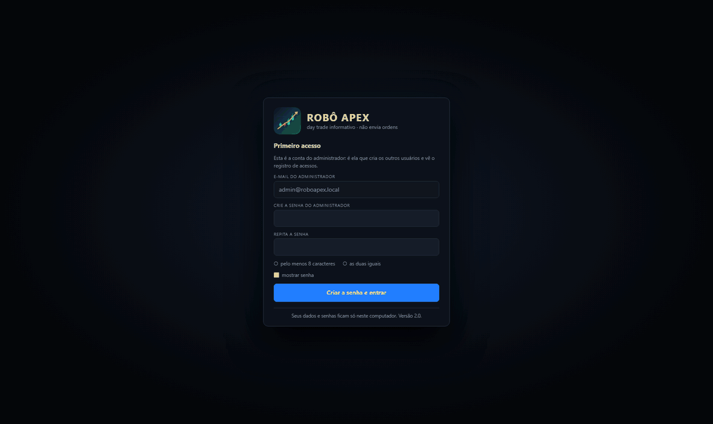

---

## Novidades da versão 2.3

- **Replay da entrada:** clique numa operação da lista e em **▶ Replay da entrada**: o gráfico toca candle a candle,
  de antes do sinal até a saída, dizendo em que etapa está (sinal, ordem armada, entrada, stop e alvos, saída), com
  pausa e velocidade de 1x a 10x.
- **E se…:** refaz a mesma entrada com outro stop e outro alvo nos candles reais e aplica o mesmo ajuste a todas as
  operações da estratégia no período, para mostrar se a correção vale no geral ou só naquela operação.
- **Suas lições** (aba IA): os ajustes salvos, o ajuste médio por estratégia e o efeito dele no conjunto. O ajuste
  ainda não entra sozinho nos sinais ao vivo.

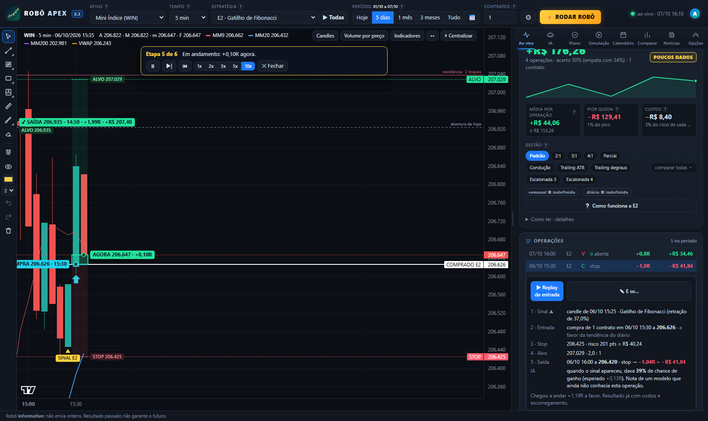

## Novidades da versão 2.2

- **Operações legíveis no próprio gráfico:** cada operação tem uma caixa na cor do resultado, a placa de **entrada**
  (lado, preço e horário), a de **saída** (preço, horário, R e dinheiro), as de **stop** e **alvos** e o candle do
  **sinal** marcado. A ordem armada aparece como uma zona à frente, com entrada, stop e alvo.
- O número da versão aparece no topo, ao lado do nome.

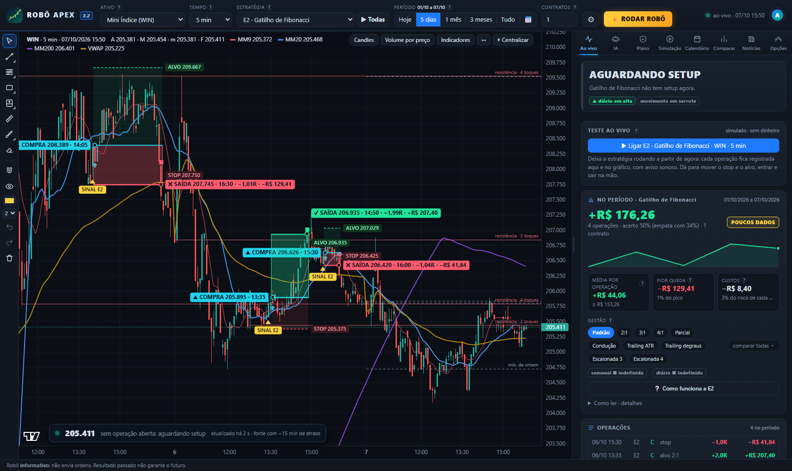

## Novidades da versão 2.1

- **Entrada e saída escritas no gráfico:** as últimas operações levam o texto na própria marca ("COMPRA 128.450",
  "SAÍDA 128.900 +2,0R"); a operação aberta aparece sempre completa, com o horário de entrada e de saída.
- **Painel AO VIVO sobre o gráfico:** preço atual, o que o robô está fazendo (entrada, stop, alvos, resultado) e há
  quantos segundos chegou o último dado. No WIN e no WDO ele avisa do atraso de cerca de 15 min da fonte gratuita.
- **Volume por preço** (botão no gráfico), estilo Profit: volume em cada faixa de preço, POC, área de valor, os três
  principais pontos de compra e de venda e quantas entradas das estratégias aconteceram em cada lugar. É uma
  estimativa feita com os candles (no WIN e no WDO, que não trazem volume, vira "tempo no preço"); livro de ofertas e
  times & trades de verdade só com a conexão do Profit.
- **Aba Opções da B3** (no lugar da Cripto): grade de calls e puts com dados oficiais da B3, gregas e volatilidade
  implícita calculadas aqui, cinco estruturas clássicas com gráfico de ganho e perda (lançamento coberto, venda de put
  com caixa, trava de alta, trava de baixa e collar), montador de estruturas, triagem de oportunidades e glossário.
  Para aprender: grade de fim de dia + cotação com cerca de 15 min de atraso, preços de último negócio.
- **Gestões Escalonada 3 e Escalonada 4:** com 3 contratos, 2 saem no alvo 1, o stop vai para o 0x0 e o último segue
  por trailing; com 4, saem 2 no alvo 1 e 1 no alvo 2.
- **Proteções do stop** (aba Plano): corte antecipado em meia perda, stop para −20% ou 0x0 quando perde força, folga
  atrás do stop técnico (20 pontos com o índice em 130 mil) e tolerância de +20% em sinal forte. Cada uma mostra o
  "com × sem" no seu período.
- **E14 e E15:** versões da E2 (Gatilho de Fibonacci) e da E9 (pivô + Fibonacci) com stop curto. As originais não
  mudaram em nada.
- **Ajuste pela IA** (aba IA): testa 60 combinações de gestão e proteções na estratégia escolhida; escolhe usando só
  a primeira metade do histórico e só sugere se passar também na segunda.
- **Profit:** a ponte está estruturada (`app/profit.py`) e registra em arquivo cada ordem armada dos testes ao vivo,
  em modo simulador. A ligação de verdade (tempo real e ordens) depende da ProfitDLL, vendida à parte pela Nelogica.
- O mercado de **cripto** saiu do robô.

**O que os testes da 2.1 mostraram** (11 ativos, 5, 15 e 60 min, com custos): E14 −0,39R por operação (135 operações)
contra −0,20R da E2; E15 −0,26R (159) contra −0,17R da E9; Escalonada 3 e 4 sobem o acerto de 38% para 44%, mas a média
fica em −0,20R e −0,22R; as proteções do stop diminuem a perda média em cerca de 15% e aumentam o número de perdas, sem
mudar o saldo. Nada disso é "ganhador" nesses dados: são opções para testar no seu ativo, com o número à vista.

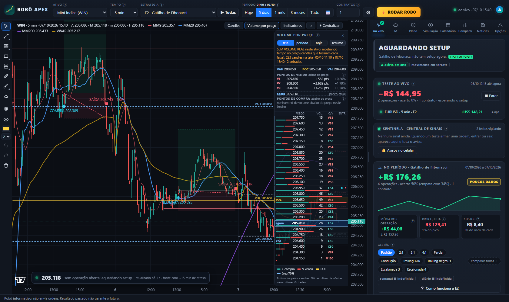

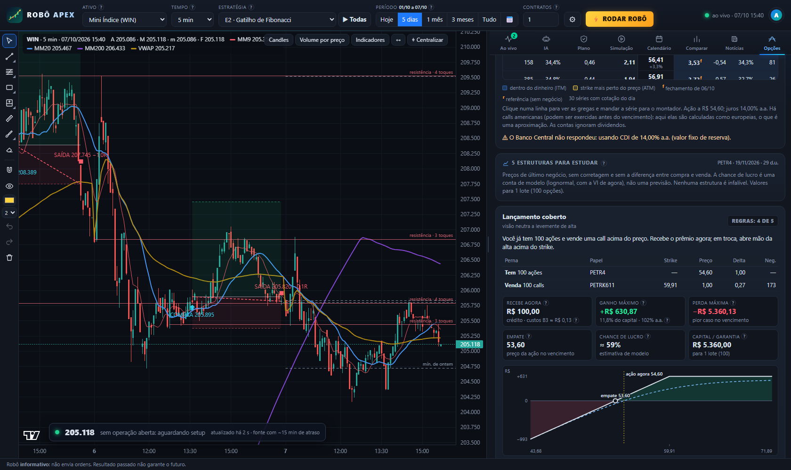

## Novidades da versão 2.0

- **Nome novo:** o projeto agora se chama **Robô Apex** (programa, janela, scripts do Profit e repositório).
- **Entrada com senha e usuários:** tela de login, conta de **administrador** (`admin@roboapex.local`) que cria
  usuários, redefine senhas e vê o **registro de acessos**. Cada usuário tem os seus testes, desenhos e avisos.
- **Sentinela + central de sinais:** os testes ao vivo passaram a rodar dentro do robô, não na tela. Continuam
  vigiando com a janela minimizada ou fechada e registram cada sinal (ordem armada, entrada, saída), com aviso sonoro,
  aviso do Windows e, se você quiser, **aviso no celular pelo Telegram**.
- **Mexer no teste na mão:** **arrastar o stop e o alvo no gráfico**, digitar os preços, **entrar agora**, **cancelar a
  ordem** e **sair agora**. Tudo simulado; o que foi mexido fica marcado com ✋.
- **IA:** aprende com as operações encerradas de todas as estratégias no ativo e estima a chance de ganho de cada
  sinal. A nota dela é medida **fora da amostra** e a tela diz quando ela **não** acerta mais que o acaso. Mostra as
  lições que os dados sustentam e o que deu errado que poderia ter dado certo.
- **Trailing stop e gestões lado a lado:** oito gestões nos botões do painel (Padrão, 2:1, 3:1, **4:1**, Parcial,
  Condução, **Trailing ATR** e **Trailing em degraus**) e a comparação de todas no mesmo período, com um clique.
- **Duas estratégias de Fibonacci:** **E12 · Fibo ABC** (três alvos projetados) e **E13 · Fibo 50** (ordem limitada na
  metade da pernada), as duas com médias alinhadas e stop abaixo da pernada.
- **Desenho no gráfico como no TradingView/Profit:** retração e **projeção de Fibonacci**, raio, linha estendida, seta,
  canal paralelo, elipse, posição comprada/vendida; **selecionar, mover e ajustar** com o mouse; **Ctrl+C / Ctrl+V**,
  duplicar, desfazer e refazer.
- **Candles do seu jeito:** cores de alta e de baixa, cheio ou vazado e a opção de **colorir pela tendência** das médias.
- **"?" em tudo:** pequenos pontos de interrogação e dicas ao passar o mouse explicam cada botão e cada número, e o
  botão **Como funciona** abre uma minijanela com o desenho e o **passo a passo** de cada estratégia.
- **Painel reorganizado:** abas com ícones, cartão do momento com a régua stop — entrada — alvo, quadrinhos de número.
- **Sem travar:** a tela pede ao robô só o trecho novo dos candles a cada 5 s, cada ativo é renovado em segundo plano
  (um site lento não segura os outros) e um pedido que não volta é abandonado em vez de congelar a tela.

## Como abrir

- **`RoboApex.exe`** (na página de *Releases* do GitHub): dois cliques. Abre uma janela com o robô; a janela preta
  precisa ficar aberta (é nela que o Sentinela trabalha).
- Ou, com Python 3.10+ instalado: **`Abrir_Robo_com_Python.bat`** (não precisa instalar nenhuma biblioteca).

**Primeiro acesso:** o robô pede para você **criar a senha do administrador** (e-mail `admin@roboapex.local`). Não
existe senha de fábrica. Depois, em **conta → Usuários**, o administrador cria os outros usuários: o robô sorteia uma
senha provisória, mostra uma única vez, e a pessoa é obrigada a criar a dela ao entrar.

**Esqueci a senha:** usuário comum pede ao administrador para redefinir. Administrador: feche o robô e abra uma vez com
`RoboApex.exe --redefinir-admin` (ou `python app/robo_apex.py --redefinir-admin`); ele volta ao primeiro acesso sem
apagar os dados.

Os dados baixados, os usuários, os desenhos e o histórico ficam na pasta `dados` (ao lado do .exe). As senhas são
guardadas embaralhadas (PBKDF2-SHA256 com sal por usuário); depois de 5 erros seguidos a entrada trava por alguns
minutos. O robô só atende pedidos feitos neste computador.

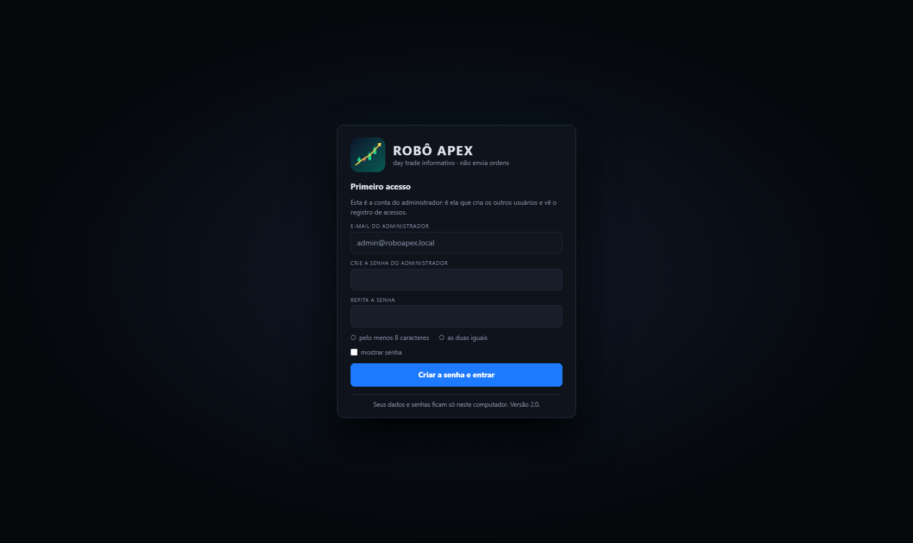

## A tela

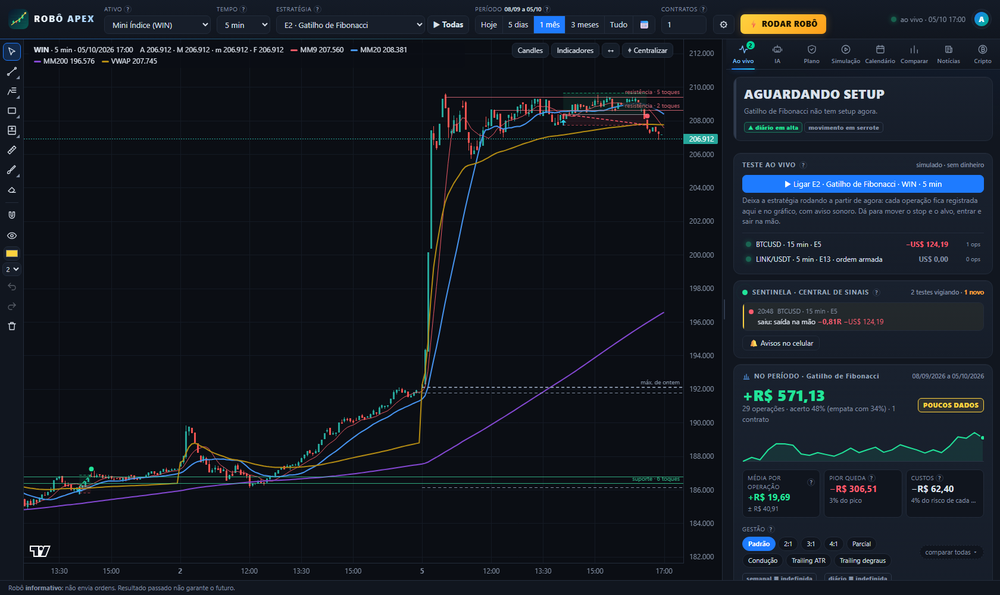

**Topo (uma linha só):** ativo · tempo gráfico · **estratégia** (menu com as 15, ou **▶ Todas**) · **período** ·
contratos · **⚙** (gestão, capital, stops por dia, sons, aviso do Windows) · **⚡ RODAR ROBÔ** · luz verde = ao vivo ·
**conta**.

**Período (Hoje · 5 dias · 1 mês · 3 meses · Tudo · 📅 datas):** vale para tudo. O gráfico mostra aquele período e
todos os números (resultado, acerto, pior queda, calendário, simulação, comparação, plano) passam a ser daquele período.
Escolhendo datas no passado, o cartão mostra a situação no fim do período (luz laranja = histórico).

**▶ Todas:** as 15 estratégias procuram entrada ao mesmo tempo, com **uma operação por vez** (a primeira ordem que
executar vale; as outras são canceladas). Clique de novo para voltar à estratégia anterior.

**⚡ RODAR ROBÔ:** testa todas as estratégias em 5, 15 e 60 min no ativo e abre uma janela com a **estratégia do
momento** (a que mais rendeu por dia nos últimos 20 pregões, puxada para o histórico todo para não escolher por sorte
de uma semana) e a **projeção** para o próximo mês e até 31/12 (Monte Carlo com as operações reais dela: resultado mais
provável, faixa de 8 em 10 cenários, chance de terminar no prejuízo e a queda que pode aparecer no caminho). Se nenhuma
tiver histórico positivo com pelo menos 20 operações, ele diz **FICAR DE FORA**.

| Aba | O que faz |
|---|---|
| **Ao vivo** | Cartão "o que fazer agora" (aguardando, atenção, ordem armada, em operação ou **PARE POR HOJE**) com a régua stop — entrada — alvo, tamanho e risco em dinheiro e em % do capital e a chance estimada pela IA; o **teste ao vivo**; a **central de sinais**; o resultado da estratégia no período (curva, custos, veredito e os botões de **gestão**); e a lista de **operações**: clique numa para ver no gráfico e ler o passo a passo. Atualiza a cada 5 s. |
| **IA** | O que o robô aprendeu neste ativo: selo (aprovada ou não fora da amostra), o sinal de agora, o que teria acontecido seguindo as notas, lições, erros e acertos, o que mais pesa na nota e o diário de aprendizado. |
| **Plano** | As regras de risco do robô inteiro, o estado do dia, a calculadora de tamanho, o efeito de cada regra e a conta meta × realidade. |
| **Simulação** | Resultado do período com curva do capital, resultado por mês e cada operação (CSV). **Assistir candle a candle** faz o gráfico andar como se fosse ao vivo. |
| **Calendário** | Resultado de cada dia; clique no dia para ver cada operação. Com Todas dá para ver cada estratégia sozinha. |
| **Comparar** | As 15 estratégias + Todas em todos os ativos, no período escolhido, colorido pelo veredito. |
| **Notícias** | **Agenda econômica** da semana e as notícias (Banco Central, Valor, InfoMoney, Money Times, g1, E-Investidor, Investing e Google Notícias), com o impacto estimado. |
| **Opções** | Grade de opções da B3, gregas, volatilidade e cinco estruturas com gráfico de ganho e perda. |

**"?" e dicas:** passe o mouse num botão para ler o que ele faz; os pontinhos **?** ao lado dos rótulos e dos números
explicam o que aquilo quer dizer (clique também abre, para quem usa toque).

**Como funciona:** o botão no painel Ao vivo abre a minijanela da estratégia escolhida, com o desenho do setup
(compra e venda), o passo a passo numerado, a gestão e onde ela costuma se encaixar.

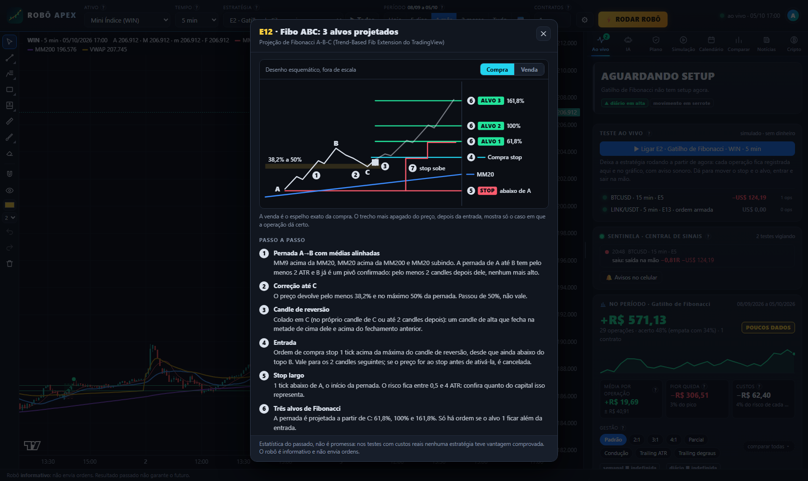

### Teste ao vivo, Sentinela e central de sinais

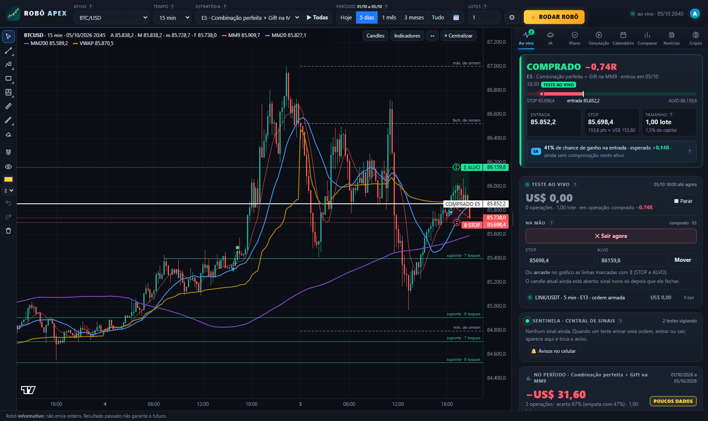

**▶ Ligar** (aba Ao vivo) deixa a estratégia escolhida rodando a partir do próximo candle, em modo **simulado, sem
dinheiro**, com as regras do plano daquele momento. Quem roda o teste é o **Sentinela**, uma parte do robô que confere
cada teste ligado a cada poucos segundos: pode trocar de ativo, de aba, minimizar ou fechar a janela do navegador que
ele continua (a janela preta do robô precisa ficar aberta). Dá para ligar até 30 testes ao mesmo tempo.

- **Sinais:** ordem armada ("tic-tic"), entrada executada ("ta-dam"), saída no ganho e saída na perda, cada um com o
  seu som. Com a janela escondida o aviso chega na mesma hora, e o **aviso do Windows** (⚙ ou conta → Avisos) mostra
  o sinal por cima do que você estiver fazendo.
- **Central de sinais:** os últimos sinais de todos os testes, com horário, ativo, estratégia, o que aconteceu e a
  chance que a IA dava. Clique num sinal para abrir aquele ativo e aquele teste.
- **Aviso no celular (Telegram):** em **conta → Avisos no celular** você cola o código do **seu** robô do Telegram
  (criado no @BotFather) e o número da sua conversa. O código fica só na pasta de dados do seu computador. O botão
  "Enviar aviso de teste" confere se chegou.
- **Na mão:** com o teste ligado, o cartão do momento passa a mostrar o teste e as linhas **⇕ STOP** e **⇕ ALVO** do
  gráfico podem ser **arrastadas**. No cartão do teste há os campos para digitar os preços e os botões **Sair agora**,
  **Entrar agora** e **Cancelar ordem** (o primeiro clique arma, o segundo confirma). Stop e alvo movidos com o candle
  aberto valem **a partir do candle seguinte**; entrar, sair e cancelar valem na hora, pelo preço daquele instante,
  com o escorregamento de sempre. O stop só pode ficar do lado da perda e o alvo do lado do ganho.
- Uma operação mexida na mão fica marcada com **✋** e deixa de ser a estratégia pura: o resumo do período, logo
  abaixo, continua mostrando a estratégia sem ajustes, para dar para comparar.
- **■ Parar** encerra e guarda o resultado. Se o robô ficou fechado, ao abrir ele reconstitui pelos candles o que teria
  acontecido.

**Candle aberto:** ao vivo, o último candle ainda está se formando. Nele o robô executa ordem, stop e alvo (o preço já
negociou), mas **sinal novo só sai depois que o candle fecha**, para o sinal não aparecer e sumir.

### Aba IA

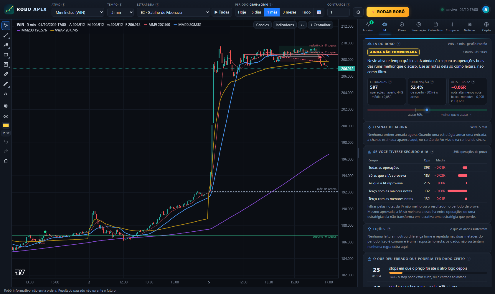

- **Como aprende:** no candle de cada sinal o robô guarda 15 leituras do momento (tamanho do stop, custo em relação
  ao risco, tendência do diário, movimento limpo ou em serrote, distância das médias e da VWAP, IFR, volume, hora do
  pregão, volatilidade, relação alvo/risco, profundidade da correção), só com candles já fechados. Um modelo
  estatístico simples (regressão logística, sem biblioteca externa) aprende quais retratos terminaram em ganho. A cada
  10 minutos o robô confere se o mercado produziu operações novas e refaz o modelo com elas.
- **A nota é honesta:** o histórico é cortado em blocos de tempo; para cada bloco a IA treina só com o que já tinha
  terminado antes dele e dá nota ao bloco. O selo **APROVADA FORA DA AMOSTRA** só aparece se as operações de nota alta
  renderem mais que as de nota baixa com folga e isso se repetir nas duas metades da prova. Caso contrário a tela diz
  **AINDA NÃO COMPROVADA** e a chance vira só uma leitura.
- **No sinal:** a ordem armada mostra a chance estimada, o resultado esperado e as leituras que mais empurraram a
  nota para cima (▲) e para baixo (▼).
- **Lições:** leituras em que o resultado foi claramente diferente (pelo menos 40 operações de cada lado, diferença
  forte e com o mesmo sinal nas duas metades). Com menos que isso apareciam "lições" por puro acaso.
- **O que deu errado que poderia ter dado certo:** stops em que o preço foi ao alvo logo depois, perdas que chegaram a
  +1R antes de virar e ganhos em que o preço andou mais 1R depois da saída. Serve para escolher o que testar na gestão.
- Precisa de pelo menos 150 operações encerradas no ativo e tempo gráfico para começar.

### Gestões e trailing stop

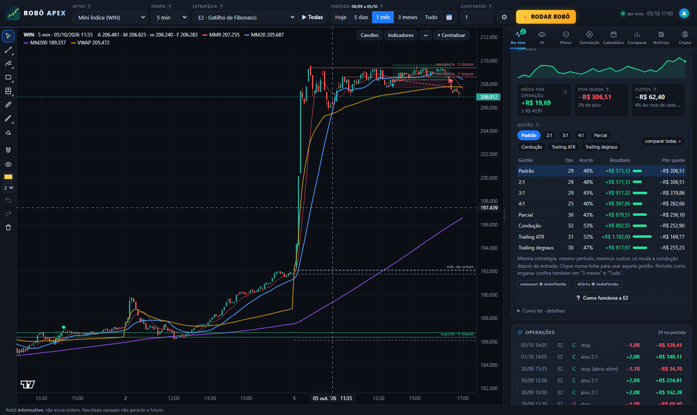

Os botões **Gestão** do painel Ao vivo (e o menu em ⚙) trocam a condução da operação depois da entrada:

| Gestão | O que faz |
|---|---|
| Padrão | a de cada estratégia (veja as regras) |
| 2:1 · 3:1 · 4:1 | tudo no alvo a 2, 3 ou 4 vezes o risco |
| Parcial | metade no 1:1, stop no 0x0, resto no 2:1 |
| Condução | metade no 1:1, stop no 0x0, resto carregado pela MM9 |
| **Trailing ATR** | sem alvo: o stop acompanha o preço a 2 ATR do melhor preço já atingido (atualiza no fechamento de cada candle) |
| **Trailing em degraus** | sem alvo: a cada 1R a favor, o stop sobe 1R |

**comparar todas** roda a mesma estratégia, no mesmo período e com os mesmos custos em cada gestão e mostra o
resultado, o acerto e a pior queda de cada uma. Parcial e os três alvos das estratégias de Fibonacci precisam de 2 ou 3
contratos na B3 (com 1 contrato só o stop sobe).

### Aba Plano

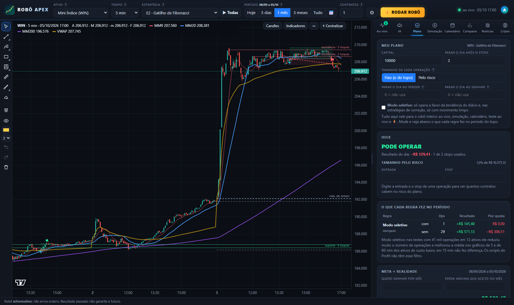

O que vale aqui vale para o robô inteiro: ao vivo, simulação, calendário, comparação, teste ao vivo e ⚡.

- **Tamanho de cada operação:** *Fixo* (a quantidade do topo) ou **Pelo risco**: você diz quanto do capital aceita
  perder por operação (por exemplo 1%) e o robô calcula a quantidade pela distância do stop, já com os custos. Se nem o
  lote mínimo cabe, a ordem fica de fora ("fora do plano") e isso aparece na tela.
- **Parar o dia:** depois de N stops, ao perder um valor ou ao ganhar um valor. Quando bate, o cartão vira
  **PARE POR HOJE** e o robô não arma mais nada naquele dia.
- **Modo seletivo:** as estratégias de correção (E1 a E5, E9, E12 e E13) só entram a favor da tendência do diário e
  com movimento limpo (eficiência de Kaufman ≥ 0,35); a E7 e a E11 só entram a favor do diário. A E6, a E8 e a E10,
  que operam a volta do preço, não mudam.
- **Hoje**, **calculadora de tamanho**, **o que cada regra fez no período** (a mesma simulação com e sem cada regra) e
  **meta × realidade** (4.000 meses sorteados com os dias reais da estratégia; só calcula com pelo menos 20 pregões e
  20 operações).

### Gráfico

**Desenhos** (barra à esquerda, em grupos; o triângulo no canto do botão abre as outras ferramentas do grupo):

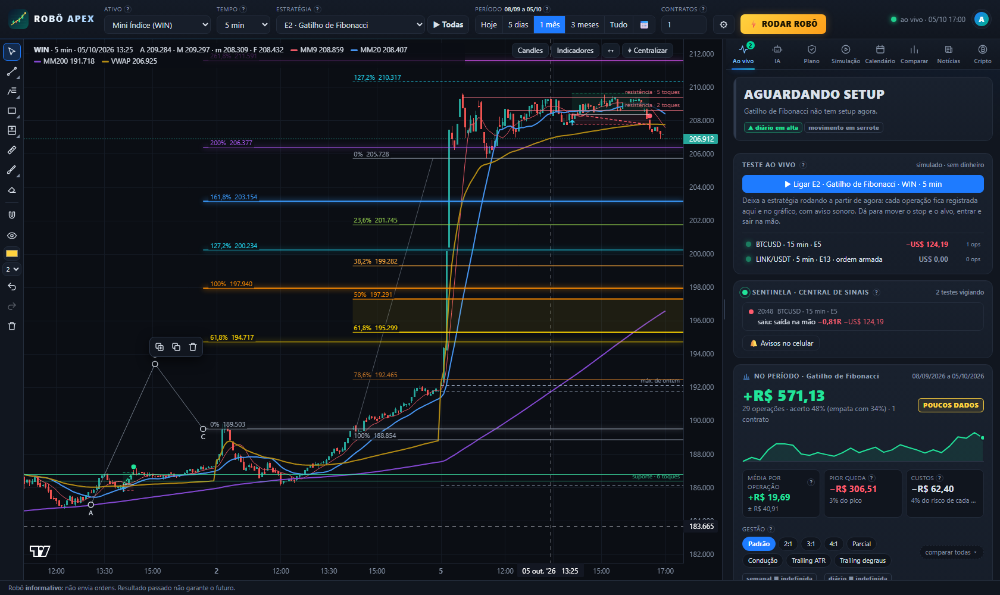

- **Linhas:** tendência, raio, linha estendida, seta, horizontal, raio horizontal, vertical e canal paralelo.
- **Fibonacci:** **retração** (23,6%, 38,2%, 50%, 61,8% com a zona de ouro, 78,6% e as extensões 127,2% e 161,8%) e
  **projeção** em três cliques (A, B, C) com os alvos 61,8%, 100%, 127,2%, 161,8%, 200% e 261,8%.
- **Formas, posição e medida:** retângulo, elipse, **posição comprada/vendida** (risco, retorno e dinheiro por
  contrato), régua, pincel e texto.
- **Mexer:** com o cursor, clique num desenho para selecionar; **arraste para mover** ou puxe as bolinhas para
  ajustar; as setas do teclado movem 1 candle / 1 tick. **Ctrl+C** copia, **Ctrl+V** cola onde o mouse estiver (até em
  outro ativo), **Ctrl+D** duplica, **Delete** apaga, **Ctrl+Z / Ctrl+Y** desfazem e refazem. A barrinha que aparece ao
  lado do desenho muda cor e espessura. Ímã (gruda nos preços do candle), olho (esconde tudo) e borracha.
- Os desenhos ficam salvos por ativo e por usuário.

**Candles** (botão no canto do gráfico, ou duplo clique num candle): cores de alta e de baixa (há um par para
daltônicos), cheio ou vazado, e **colorir pela tendência**: cor de alta quando a MM9 está acima da MM20 e o preço acima
dela, cor de baixa no inverso e cinza quando as médias não confirmam. É só aparência; as estratégias não mudam.

**Indicadores:** médias móveis à vontade (simples ou exponencial, período e cor), VWAP, Bandas de Bollinger, Canal de
Keltner, volume, IFR/RSI e estocástico lento; **níveis do dia** e até 4 **suportes e resistências**. A estratégia
escolhida mostra o indicador dela (o canal na E10, a faixa de ruído na E11). As cores padrão das médias foram
conferidas para quem não distingue bem verde e vermelho.

**Operações no gráfico:** cada operação aparece com a faixa de risco (vermelha), a faixa do alvo (verde) e a linha da
entrada até a saída; a clicada ganha os preços escritos (inclusive os alvos 1, 2 e 3) e o candle de sinal marcado.

**⌖ Centralizar** (ou tecla **Home**) volta para o último candle com a escala automática; **↔** mostra o período
inteiro. **Largura do painel:** arraste a divisória; duplo clique volta ao padrão.

**Sons próprios (opcional):** coloque arquivos `.wav`, `.mp3` ou `.ogg` na pasta `dados/sons` com os nomes `ordem`,
`entrada`, `ganho`, `perda` e `aviso`.

**Agenda econômica:** eventos com hora marcada do Brasil, dos EUA e das moedas do ativo. De 30 min antes até 10 min
depois de um evento de impacto alto, o cartão "o que fazer agora" avisa.

## Ativos e dados

| Ativo | Fonte intraday | Histórico em 2–30 min |
|---|---|---|
| EUR/USD, GBP/USD, USD/JPY, AUD/USD, **XAU/USD** | Dukascopy (feed ECN, candles de 1 min) + hoje pelo Yahoo, com nível ajustado | 5 meses |
| **USTEC** (Nasdaq 100, horário de Nova York) | Dukascopy + hoje pelo Yahoo | 5 meses |
| **JP225** (Nikkei 225, horário de Tóquio) | Dukascopy + hoje pelo Yahoo | 5 meses |
| WIN, WDO (substitutos: Ibovespa à vista e USD/BRL), prata, petróleo | Yahoo, **com cerca de 15 min de atraso** | 60 dias, e cresce: cada download fica guardado |
| Qualquer ativo | CSV exportado do Profit/MetaTrader na pasta `dados` | o que você exportar |

O diário vem do Yahoo (10 anos). A **base de 5 meses** é baixada uma vez e depois só completa os dias novos (a
Dukascopy limita pedidos, então a primeira vez leva algumas horas em segundo plano; o rodapé mostra o andamento). Os
candles de hoje são renovados em segundo plano: o Yahoo a cada ~20 s (o robô limita os pedidos por
minuto para não ser bloqueado). Para o WIN e o WDO **reais e em tempo real**, use os scripts no Profit (abaixo) ou
exporte o gráfico do Profit em CSV: nenhuma fonte gratuita entrega o mini-índice e o mini-dólar ao vivo.

## As 15 estratégias

| | Estratégia | Autor / fonte | Regras (compra; a venda é o espelho exato) | Onde se encaixa |
|---|---|---|---|---|
| E1 | Halt na MM20 | Pisani + Velez | MM20 inclinada, acima da MM200; correção de 1 a 8 candles (3-5-8) que encosta na MM20 sem fechar abaixo; sem barra elefante contra; candle de confirmação (1 candle só com Gift) | 5 e 15 min, ativos em tendência |
| E2 | Gatilho de Fibonacci | Pisani | Impulso ≥ 2 ATR; correção entre 38,2% e 61,8%; candle de confirmação acima de 61,8% | 5 e 15 min; diário em ouro e prata |
| E3 | Pullback na VWAP | Pisani + Velez | Dia de tendência (70% dos fechamentos acima da VWAP), afastou 1 ATR e voltou a testar a VWAP sem fechar abaixo | 15 min, índices e forex |
| E4 | Rompimento de base | Velez (power breakout) | Base de 4 candles com até 1,2 ATR no topo do movimento, apoiada na MM20 | 5 min e diário |
| E5 | Combinação perfeita + Gift na MM9 | Velez + Pisani | MM9 > MM20 > MM200 inclinadas; correção de 1 a 3 candles na MM9; candle Gift | 5 e 60 min, tendência forte |
| E6 | RSI(2) de Connors | Larry Connors (fóruns) | Acima da MM200 e RSI(2) < 10: compra na abertura; sai quando fecha acima da MM5 ou em 10 candles; stop de proteção a 3 ATR | Diário, índices |
| E7 | Rompimento do 1º candle (ORB) | Zarattini & Aziz (2023) | 1º candle do pregão de alta: compra na abertura do 2º; stop na mínima do 1º; alvo 10R ou zeragem. **Acerta pouco (~20%) e ganha grande** | 5 min, índices na abertura |
| E8 | Fechamento de gap | Estatística de gaps (Nasdaq 2015–2025) | Gap de 0,05% a 0,40% dentro da faixa de ontem, ainda aberto após 15 min: entra para fechar o gap; alvo no fechamento de ontem; stop largo. Só em dado com gap real (USTEC/JP225 da Dukascopy, CSV do Profit) | 5 min, índices futuros |
| E9 | **OGRO: pivô + Fibonacci** | Estilo André Machado (Ogro de Wall Street) | MM9 > MM20 > MM200 alinhadas; pernada ≥ 2 ATR; correção até **no máximo 50%**; compra no **rompimento do pivô**, stop abaixo do fundo; alvos na projeção de Fibonacci: 100% (metade + stop no 0x0) e 161,8% | 5 e 15 min, índices, ouro e BTC em tendência |
| E10 | **XTRADERS: Keltner lateral** | Adriano Mendes (XTraders) | Só em dia lateral: MME200 e MME500 cortando os preços do dia, VWAP plana e preço dentro do range de ontem. Compra quando o candle toca a banda de baixo (2,0 ATR) e fecha para dentro com IFR(9) abaixo de 35; stop atrás da banda de 2,5; alvo na média de 20 | 2 e 5 min, índices em dia lateral |
| E11 | **Momentum do dia (faixa de ruído)** | Zarattini, Aziz & Barbon (2024) | Compra quando o candle fecha acima de max(abertura de hoje, fechamento de ontem) + a faixa de ruído **e** acima da VWAP; decide nas horas cheias e meias horas; sai quando fecha de volta abaixo do maior entre a faixa e a VWAP, ou na zeragem. Stop de proteção a 1 ATR | 60 min, WIN e Nasdaq |
| E12 | **Fibo ABC: 3 alvos projetados** | Projeção de Fibonacci A-B-C (a ferramenta *Trend-Based Fib Extension* do TradingView) | MM9 > MM20 > MM200 e MM20 subindo; pernada A→B ≥ 2 ATR com o topo B confirmado; correção até C que busca 38,2% e **não passa de 50%**; candle de reversão colado em C: compra 1 tick acima dele; **stop 1 tick abaixo de A**; **três alvos** projetados a partir de C: 61,8%, 100% e 161,8% (um terço em cada; no alvo 1 o stop vai para a entrada, no 2 vai para o alvo 1) | 60 min, ativos em tendência |
| E13 | **Fibo 50: ordem limitada na pernada** | Entrada na zona de retração (família *Golden Pocket* / OTE, com o nível nos 50%) | MM20 e preço acima da MM200, médias alinhadas no topo; pernada A→B ≥ 2,5 ATR; **compra limitada nos 50%** da pernada, parada esperando o preço recuar (vale até 20 candles, enquanto não houver topo novo); **stop 1 tick abaixo de A**; alvos: o topo B, 127,2% e 161,8% da pernada | 60 min, ativos de custo baixo |

"Onde se encaixa" é o ponto de partida; o **⚡ RODAR ROBÔ** mede isso de novo com os dados de hoje. A E11, a E12 e a
E13 existem só no aplicativo (sem script do Profit).

Filtros comuns: risco entre 0,3 e 2,5 ATR nas estratégias de Pisani/Velez, no OGRO e no Keltner (a E6, a E7, a E8, a
E11, a E12 e a E13 têm regra de stop própria; nas duas de Fibonacci o stop fica abaixo da pernada e pode ser largo:
confira o % do capital no cartão). No intraday, sem entradas fora do horário, zeragem no horário do ativo e o dia para
depois de N stops (padrão 2).

## Como o simulador executa (conservador de propósito)

- Ordem stop executa no gatilho (ou na abertura, se abrir além) **mais o escorregamento**; stop sai **menos** o escorregamento.
- **Ordem limitada (E13):** só executa se o preço passar **1 tick além** do nível, sem melhora de preço.
- Alvo só conta se o preço passar **1 tick além** dele; candle que toca stop e alvo conta como **stop**.
- Saídas por fechamento (MM9, RSI-2, faixa de ruído) executam na abertura do candle seguinte. O trailing ATR é
  recalculado no fechamento de cada candle e vale a partir do seguinte.
- Custos por lado: WIN 5 pts + R$ 0,30 · WDO 0,5 pt + R$ 1,20 · forex 0,6–0,8 pip + US$ 3,50 · ouro 0,20 ·
  USTEC 1 pt · JP225 5 pts.
- **Tamanho pelo risco** e **limites do dia** como descrito na aba Plano.
- **Ajustes na mão (teste ao vivo):** nunca valem para trás. Stop e alvo movidos valem do candle seguinte em diante;
  sair e entrar usam o preço do instante do clique.

Conferências desta versão:

- o simulador novo refez **632 simulações (76.914 operações)** com resultado idêntico ao da versão 1.3;
- retomar a conta de onde parou em vez de refazer tudo: 208 casos idênticos; candle aberto: 392 casos;
- a atualização que manda só o trecho novo: **720 passos** de uma sessão ao vivo simulada (candle andando, fechando e
  nascendo), e a tela ficou sempre igual a uma resposta completa calculada do zero;
- servidor pela porta (sem sessão nada funciona, pedidos de fora deste computador recusados, um usuário não enxerga o
  outro, senha provisória, regras do administrador, registro sem senhas, testes ao vivo, IA, gestões): 0 problemas;
- a tela no navegador, comandada por um teste automático: dicas, gestões, candles, Fibonacci, mover, copiar, colar,
  desfazer, troca rápida de telas, arrastar o stop, alvo digitado, sair e entrar na mão, central de sinais, login,
  usuários, registro, as 14 minijanelas, replay, calendário, comparação e plano: **102 verificações, 0 problemas**;
- ajustes na mão com o relógio do computador atrasado, certo e adiantado, e com os dados atrasados: 56 casos, sempre no
  candle certo e com um único aviso; vários pedidos ao mesmo tempo para o mesmo ativo e o mesmo teste: sem erro;
- os 10 scripts do Profit continuam dando ordens e operações idênticas às do programa.

Não foi possível testar daqui: o envio real pelo Telegram (precisa do seu robô do Telegram; use "Enviar aviso de
teste"), o aviso do Windows (depende de o navegador permitir) e os scripts compilados dentro do Profit.

## Como ler o veredito

| Veredito | Quando |
|---|---|
| **VANTAGEM ESTATÍSTICA** | média por operação positiva, margem de erro (95%) acima de zero e positiva nas duas metades |
| INSTÁVEL | positiva no total, mas uma das metades foi negativa |
| PROMISSORA, NÃO COMPROVADA | positiva, mas a margem de erro ainda inclui zero (pode ser sorte) |
| POUCOS DADOS | menos de 30 operações |
| NÃO OPERAR | média negativa depois dos custos |

## O que os dados mostraram (05/10/2026)

- **O custo decide.** Em 5 e 15 min as estratégias perdem na média depois dos custos. O resumo de cada estratégia
  mostra o custo em % do risco e avisa quando ele passa de 15%.
- **Nenhuma estratégia chegou a "vantagem estatística".** Em 60 min o conjunto fica perto do zero; nos ativos de custo
  baixo (WIN, Nasdaq, ouro, BTC, Nikkei) levemente positivo, ainda sem comprovação.
- **As duas estratégias novas de Fibonacci não bateram as que já existiam.** Em 12 ativos (5, 15 e 60 min, com
  custos): E12 −0,14R por operação em 421 operações; E13 −0,08R em 1.755 operações; as duas ficam perto do zero só em
  60 min. Para comparar, a E2 fez −0,13R em 5.970 operações (no WIN sozinho, +0,15R em 178 operações, ainda dentro da
  margem de erro) e a E9, −0,09R.
- **"Retração de até 50% reverte mais"?** Os dados não confirmaram: as correções rasas (até 50%) renderam −0,13R por
  operação e as mais fundas −0,14R, diferença que cabe no acaso. Entre os níveis de entrada limitada testados (38,2%,
  50%, 61,8% e 70,5%), o de 50% foi o menos ruim.
- **Trailing stop:** no conjunto dos ativos nenhuma gestão virou o jogo (todas negativas na soma). Em casos isolados o
  trailing foi melhor (na E2 do WIN de 5 min, no último mês, o Trailing ATR rendeu mais que os alvos fixos), mas com
  cerca de 30 operações isso ainda é amostra pequena. Use **comparar todas** no seu ativo e período.
- **IA:** no WIN de 5 min a nota fora da amostra ficou em torno de 48% a 52% de acerto de ordenação (50% é o acaso):
  **não comprovada**, e a tela diz isso. Ela pode se sair melhor em outro ativo ou com mais histórico; o selo muda
  sozinho se e quando a prova passar.
- **Modo seletivo**, **E11**, **meta diária** e **memes da Binance:** valem as conclusões da versão 1.3 (o seletivo
  ajudou em 5 e 60 min; a meta diária não mostrou ajudar; nas memes o rompimento com volume aumenta o tamanho do
  movimento para os dois lados, não a direção).
- **Para comparar:** num estudo da FGV com dados da CVM, de cada 100 pessoas que fizeram day trade de mini-índice por
  mais de 300 pregões, 97 perderam dinheiro e só 1 ganhou mais que um salário mínimo (fontes no fim).

Esses números mudam a cada pregão: use **⚡ RODAR ROBÔ**, a aba **Comparar**, a aba **IA** e a aba **Plano** antes de decidir.

## Scripts do Profit (NTSL)

Pasta `ntsl`: um indicador por estratégia (`E1_Halt_MM20.ntsl` … `E10_XTraders_Keltner.ntsl`). No Profit:
*Ferramentas → Editor de Estratégias → Novo → Indicador*, cole, compile e aplique no gráfico de preço.
Linha **branca** = entrada, **vermelha** = stop, **verde** = alvo. É o caminho para ver os sinais no WIN e no WDO
reais, em tempo real.

| Parâmetro | WIN | WDO |
|---|---|---|
| Tick / Slip | 5 / 5 | 0,5 / 0,5 |
| CustoPts (ida e volta, em pontos) | 3 | 0,24 |
| HoraInicio / HoraFimEntradas / HoraZeragem (contrato real) | 905 / 1700 / 1745 (E7 e E8: HoraInicio 0) | 905 / 1700 / 1745 |
| FracParcial (E9) | 0 com 1 contrato, 0,5 com 2 ou mais | idem |
| Intraday | 1 (0 no diário) | 1 |

`ferramentas/conferir_ntsl.py` roda os 10 scripts num interpretador de NTSL sobre os mesmos candles e compara com o
programa: ordens e operações **idênticas**. Ainda não foram compilados dentro do Profit; se o Profit acusar algum erro,
mande o print. A E11, a E12, a E13, o trailing stop, o modo seletivo, as regras do plano, a IA e o Sentinela existem só
no aplicativo.

## Para quem mexe no código

```
app/estrategias.py   indicadores, contexto (tendência do diário, eficiência) e as 13 regras
                     (compra escrita uma vez; venda = gráfico invertido)
app/simulador.py     execução candle a candle (ordens stop e limitadas, 8 gestões, ajustes na mão, retomada),
                     plano de risco e estatística (com custos)
app/ia.py            IA: retrato de cada sinal, regressão logística, prova fora da amostra, lições e erros
app/auth.py          usuários, senhas (PBKDF2), sessões, bloqueio por tentativas e registro de acessos
app/avisos.py        avisos dos sinais pelo Telegram
app/plano.py         meta × realidade: sorteio de dias inteiros, margem de erro, teto de Kelly
app/radar.py         "RODAR ROBÔ": estratégia do momento e projeção (Monte Carlo)
app/opcoes.py        opções da B3: grade oficial, Black-Scholes, gregas, volatilidade implícita e as cinco estruturas
app/profit.py        ponte com o Profit (estrutura pronta; ordens só em modo simulador)
app/agenda.py        agenda econômica (ForexFactory, IBGE, Copom)
app/noticias.py      notícias (RSS/Atom) com classificação de impacto
app/historico.py     base de 5 meses (Dukascopy e Binance)
app/dados_fonte.py   fontes, fusos, custos por ativo, CSV do Profit e os dados "vivos" (cada fonte renovada em
                     segundo plano, só o trecho novo)
app/robo_apex.py     servidor local: acesso, /api/sim (completo ou só o trecho novo), Sentinela (/api/testes,
                     /api/teste), /api/ia, /api/gestoes, /api/metas, /api/radar, /api/comparar, /api/noticias,
                     /api/agenda, /api/opcoes/..., /api/ajuste, /api/profit/estado, /api/admin/...
app/web/             tela: entrar.html/js (login), app.js (núcleo), ops.js (operações, teste ao vivo, central de
                     sinais), ia.js, desenho.js, explica.js (minijanelas), conta.js (conta e administração),
                     dicas.js, ind.js, plano.js, opcoes.js, perfil.js, sim.js, radar.js, calendario.js, comparar.js, noticias.js
ferramentas/backtest.py       relatório no terminal:  python ferramentas/backtest.py WIN --tf 15
ferramentas/gerar_ntsl.py     gera a pasta ntsl a partir das mesmas regras
ferramentas/conferir_ntsl.py  confere o NTSL contra o simulador
ferramentas/gerar_icone.py    gera o ícone e a tela de abertura do .exe
```

Opções da linha de comando: `--porta N`, `--sem-janela`, `--sem-base`, `--base <pasta>`, `--redefinir-admin`.

## Fontes

- Mario Pisani, apostila 2022; Oliver Velez, apostila de análise técnica.
- André Machado (Ogro de Wall Street): pivôs, Fibonacci e médias — [Projeto Os 10%](https://projetoos10porcento.com.br/aprenda-com-o-ogro-de-wall-street-a-dominar-ranges-e-breakouts-para-entradas-mais-seguras/),
  [Eu Quero Investir](https://euqueroinvestir.com/educacao-financeira/day-touro-andre-machado-ogro-de-wall-street).
  A E9 é uma leitura objetiva da regra descrita, não o método oficial dele.
- **Fibonacci (E12, E13 e as ferramentas de desenho):** ajuda do TradingView para a
  [retração](https://www.tradingview.com/support/solutions/43000518158-fib-retracement/), a
  [projeção por tendência (Trend-Based Fib Extension)](https://www.tradingview.com/support/solutions/43000518137-trend-based-fib-extension-drawing-tool/),
  a [retração automática](https://www.tradingview.com/support/solutions/43000585089-auto-fib-retracement/) e a
  [extensão automática](https://www.tradingview.com/support/solutions/43000612397-auto-fib-extension/); scripts
  públicos da biblioteca do TradingView que serviram de referência para as regras:
  [Dynamic Trend-Based Fibonacci Extension Pro (MarkitTick)](https://www.tradingview.com/script/Y0TzgUaW-Dynamic-Trend-Based-Fibonacci-Extension-Pro-MarkitTick/),
  [Auto Fib Extension Targets A-B-C (MartenBG)](https://www.tradingview.com/script/xxF3Zan6-Auto-Fib-Extension-Targets-A-B-C-MartenBG/),
  [Advanced Fibonacci Golden Zone (HexaTrades)](https://www.tradingview.com/script/gmmtYKS3-Advanced-Fibonacci-Golden-Zone-HexaTrades/) e
  [Fibonacci and EMA Trend Pullback](https://www.tradingview.com/script/wT3vnL4F-Fibonacci-and-Ema-Trend-Pullback-alerts/).
  A E12 e a E13 são leituras objetivas dessas ideias, não cópias desses scripts.
- **O outro lado (quem mediu e não achou vantagem nos níveis de Fibonacci):** Thomas Bulkowski,
  [retrações](https://thepatternsite.com/fib.html) e [extensões](https://thepatternsite.com/FibExtensions.html);
  Adam Grimes, [What's wrong with Fibonacci?](https://www.adamhgrimes.com/whats-wrong-fibonacci/) e
  [o teste dele](https://www.adamhgrimes.com/testing-fibonaccis-12/);
  [testes econométricos de retrações](https://paperswithbacktest.com/strategies/can-returns-breed-like-rabbits-econometric-tests-for-fibonacci-retracements).
  O nosso teste chegou à mesma conclusão.
- Adriano Mendes (XTraders): [canal no YouTube](https://www.youtube.com/@xtraders) — aula "Keltner: o segredo pra
  operar em dias laterais". A E10 é uma leitura objetiva dessa aula, não o método oficial dele.
- Larry Connors e Cesar Alvarez, *Short Term Trading Strategies That Work* (2008) — [QuantifiedStrategies](https://www.quantifiedstrategies.com/rsi-2-strategy/).
- Zarattini & Aziz (2023), *Can Day Trading Really Be Profitable?* — [Concretum](https://concretumgroup.com/can-day-trading-really-be-profitable/).
- Zarattini, Aziz & Barbon (2024), *Beat the Market: An Effective Intraday Momentum Strategy for S&P500 ETF (SPY)* —
  [Concretum (PDF)](https://concretumgroup.com/wp-content/uploads/2026/02/Beat-the-Market.pdf).
- Estatística de gaps — [TradingStats (NQ 2015–2025)](https://tradingstats.net/gap-fill-strategy/), [Trade That Swing](https://tradethatswing.com/sp-500-spy-es-gap-fill-strategy-and-statistics/).
- Chague, De-Losso & Giovannetti (2019), *Day Trading for a Living?* — [texto (USP)](https://www.repec.eae.fea.usp.br/documentos/Chague_Losso_Giovannetti_47WP.pdf),
  [resumo da FGV](https://eesp.fgv.br/noticia/quer-viver-especulando-na-bolsa-chance-de-enriquecer-e-minima-diz-estudo).
- Solidus Labs (2025), tokens do pump.fun — [relatório](https://www.soliduslabs.com/reports/solana-rug-pulls-pump-dumps-crypto-compliance);
  carteiras no prejuízo — [CoinJournal](https://coinjournal.net/news/over-60-of-pump-fun-wallets-lost-money-report/).
- Agenda: [ForexFactory](https://www.forexfactory.com/calendar), [calendário do IBGE](https://servicodados.ibge.gov.br/api/docs/calendario?versao=3)
  e as reuniões do Copom de 2026 ([InfoMoney](https://www.infomoney.com.br/mercados/banco-central-divulga-calendario-das-reunioes-do-copom-para-2026/),
  [B3 Bora Investir](https://borainvestir.b3.com.br/noticias/copom-tera-8-reunioes-em-2026-veja-calendario-e-projecao-para-a-selic/)).
- Avisos no celular: [API de robôs do Telegram](https://core.telegram.org/bots/api#sendmessage).

## Aviso

Ferramenta de estudo. Resultado passado não garante resultado futuro, e o robô não dá recomendação de investimento.
A IA estima chances a partir do passado e erra; o Sentinela e os testes ao vivo são simulados e não enviam ordens.
A maioria das pessoas perde dinheiro com day trade e com moedas meme: os números acima são para decidir de olhos abertos.
Antes de usar dinheiro real: 100 operações no simulador da corretora seguindo o robô, e depois o menor lote possível.

## Licenças de terceiros

Gráficos: [TradingView Lightweight Charts](https://github.com/tradingview/lightweight-charts) (Apache 2.0), incluído em `app/web/lightweight-charts.js`.
